# TiDB 智能故障诊断 Agent — 架构与交付方案

> 版本：v1.7  
> 日期：2026-08-20  
> 方案选型：Dify Agent + Diagnostic API + 阿里 SLS + Prometheus  
> TiDB 目标版本：**v7.5.6**（当前方案仅支持此单一版本）  
> 设计原则：**不影响生产的主要服务组件** · **TiDB 公开资料 RAG** · **多源诊断数据融合**

---

## 1. 项目概述

### 1.1 目标

建设 **TiDB 智能故障诊断工具**（Agent），在 TiDB 发生故障时：

1. **采集**：从 SLS（日志/慢日志）、Prometheus（指标）等已有观测平台获取诊断数据，不触达 TiDB / TiKV / PD / TiFlash 等主要服务组件；
2. **检索**：基于 **TiDB 官方公开文档与排查手册** 构建 RAG 知识库，为分析提供权威依据；
3. **融合**：将实时/准实时诊断数据与知识库、规则洞察 **交叉验证**，形成完整证据链；
4. **输出**：给出 **全面、结构化、可执行** 的诊断报告（现象归纳、根因分析、证据、修复步骤、预防建议、后续排查路径）。

故障的 **起始线索** 通常由用户在对话中提供（见 §1.5），Agent 据此确定排查方向与时间窗口，再联动 SLS / Prometheus 与知识库完成验证与结论。

### 1.2 核心原则

| 原则 | 说明 |
|------|------|
| **不影响生产的主要服务组件** | Diagnostic API 不 SSH 生产节点、不直连 TiDB / TiKV / PD / TiFlash 等服务端口；只读 SLS / Prometheus 等观测中台 |
| **权威知识支撑** | RAG 库以 **TiDB / PingCAP 公开文档** 为主体，辅以内部手册与历史案例 |
| **多源数据融合** | 指标、运行日志、慢日志、告警、知识库 **联合分析**，结论需多源佐证或明确标注置信度 |
| **标准诊断流程** | 按「现象澄清 → 健康快照 → 分类排查 → 根因定位 → 方案输出 → 预防复盘」固定方法论执行 |
| **复用现有设施** | 日志/慢日志走 **阿里 SLS**；指标走 **Prometheus**；不重复建设采集链路 |
| **平台化交付** | 对话与编排使用 **Dify 自托管 Agent**；内网 **千问模型** 负责推理与报告生成 |
| **安全可审计** | API Key + RBAC + 全链路审计 + 数据脱敏 |
| **渐进式增强** | 慢日志先 API 解析，后续 SLS 加工结构化；知识库 **离线 Markdown 导入**，每季度 **人工复核** 文档内容（版本固定 v7.5.6） |

### 1.3 诊断能力三角

诊断质量依赖三类输入的协同，缺一不可：

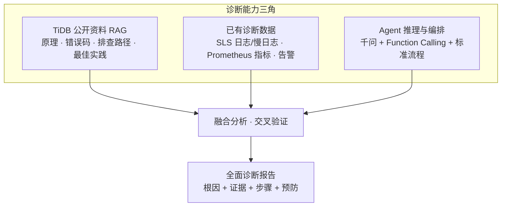

| 输入 | 作用 | 缺失时的风险 |
|------|------|--------------|
| TiDB 公开资料 RAG | 提供权威排查路径、参数含义、错误码解释 | 建议空泛、不符合 TiDB 机制 |
| 已有诊断数据 | 提供故障时间线的真实证据 | 结论无法落地、无法定位根因 |
| Agent 编排 | 按场景选工具、组织报告、控制推理边界 | 数据堆砌、无结论 |

### 1.4 不在范围内（v1）

- 自动执行修复操作（重启、缩容、杀会话、改配置）
- 替代现有告警系统
- 新建日志采集链路（复用客户已有 SLS）
- **多 TiDB 版本并存**（当前仅支持 **v7.5.6**；其他版本纳入 v2+ 规划）
- **Dify 知识库联网同步**（v1 仅支持 **离线 Markdown 导入**；URL 抓取、定时同步、在线数据源连接器纳入 v2+）

### 1.5 用户提供的故障线索

故障诊断往往 **始于用户侧信息**，而非 Agent 主动发现。运维/DBA 在 Dify 对话中可通过 **文字或图片** 提供故障来源线索，Agent 在阶段 1（现象澄清）优先解析这些内容，再决定工具调用的时间范围、关键词与排查路径。

| 线索类型 | 典型形式 | 示例 | Agent 如何使用 |
|----------|----------|------|----------------|
| **错误日志（文本）** | 粘贴 ERROR 行、应用报错栈、客户端报错 | `ERROR 9005 Region is unavailable` | 提取错误码、组件、关键词 → 驱动 `fetch_component_logs` 查询；作为 RAG 检索词 |
| **错误日志（图片）** | 终端截图、告警卡片、IM 转发截图 | 监控平台红色告警图、sql 客户端报错截图 | 多模态理解/OCR 提取错误码与时间 → **辅助定方向**；仍须 SLS/Prom 拉数验证 |
| **延迟/异常时间段** | 自然语言描述起止时间 | 「14:30–14:45 订单库 P99 从 200ms 升到 3s」 | 确定 Prom/SLS 查询的 `start_time` / `end_time`；与指标曲线对齐 |
| **现象描述** | 业务影响、组件猜测 | 「连接池打满」「写入变慢」「某库查询超时」 | 故障分类（§4.5.3）→ 选工具组合与 RAG 方向 |
| **变更/发布信息** | 运维操作说明 | 「13:00 TiUP 扩容」「刚发版」 | 对照变更前后指标；优先排查变更相关路径 |

**与观测数据的关系**：

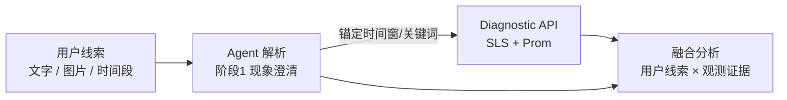

- **用户线索 = 诊断入口与锚点**：决定「查哪段时间、搜什么关键词、走哪条排查路径」。
- **SLS / Prometheus = 可验证证据**：用于确认、补充或反驳用户描述；不能仅凭用户粘贴的一行日志下结论。
- **报告中须区分来源**：证据链中分别列出「用户提供线索」与「SLS/Prom 拉取结果」；二者不一致时说明差异及可能原因（采集延迟、应用层包装、截图不完整等）。
- **图片输入**：依赖 Dify 文件上传与千问 **多模态/视觉** 能力；若当前模型不支持识图，Prompt 应引导用户 **补充文字** 或 **粘贴日志原文**。

---

## 2. 背景与约束

### 2.1 客户环境

| 项 | 现状 |
|----|------|
| **TiDB 版本** | **v7.5.6**（当前方案唯一支持版本） |
| TiDB 部署 | TiUP |
| 观测 | 已有 TiDB Dashboard、Prometheus |
| 日志 | 阿里 SLS 已采集运行日志与慢日志（慢日志暂未解析） |
| AI 平台 | Dify 自托管 |
| 大模型 | 内网千问（Qwen3.5-122B 主推理；Embedding/Rerank 用于知识库） |
| 安全 | 有合规要求，操作需可追溯，敏感数据需脱敏 |

### 2.2 TiDB 版本范围（v1）

| 项 | 说明 |
|----|------|
| 客户生产版本 | **v7.5.6** |
| 方案支持范围 | **仅 v7.5.6**，不做多版本适配 |
| RAG 文档版本 | 使用 PingCAP **v7.5** 文档线（`docs.pingcap.com/tidb/v7.5/...`），与 v7.5.6 补丁版一致 |
| Release Note | 对齐 `v7.5.6` tag（GitHub Release） |
| Prompt / 配置 | 固定写入 `tidb_version: v7.5.6`，无需运行时版本选择 |
| 后续扩展 | 客户升级 TiDB 大版本时，另起版本迭代更新 RAG 文档与 Prompt（v2+） |

### 2.3 推荐模型配置

| 用途 | 模型 | 参数建议 |
|------|------|----------|
| Agent 主推理 | Qwen3.5-122B-A10B-FP8 | temperature=0.3, top_p=0.8 |
| 知识库 Embedding | Qwen3-Embedding-4B | 默认 |
| 知识库 Rerank | Qwen3-Reranker-4B | 默认 |
| Agent 模式 | Function Calling（优先） | 不支持时降级 ReAct |

### 2.4 Dify 知识库平台约束

| 项 | 说明 |
|----|------|
| 导入方式 | **仅支持离线 Markdown 文件导入**（单文件或批量上传） |
| 联网同步 | **不支持**（无 URL 抓取、无定时同步、无 Notion / Git 等在线数据源连接器） |
| 更新方式 | 人工离线准备 Markdown → Dify 知识库 **重新导入 / 覆盖** |
| 职责边界 | 文档采集、分块加工在 **Dify 外部** 完成；v1 **不建设** 自动同步流水线 |

---

## 3. 总体架构

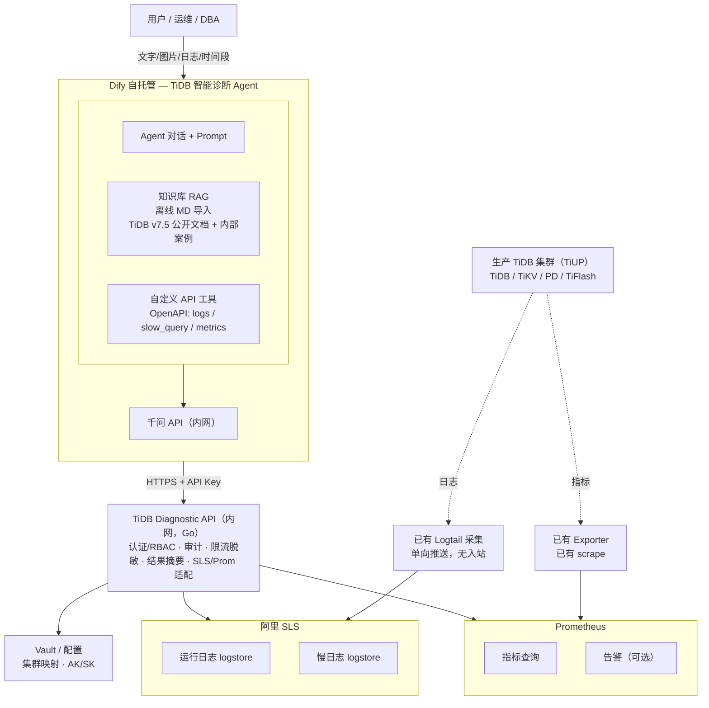

**分层说明**：

| 层级 | 组件 | 说明 |
|------|------|------|
| 用户层 | 运维 / DBA | 提供故障线索（文字、错误日志、截图、异常时间段等），接收诊断报告 |
| 编排层 | Dify Agent + 千问 + 知识库 | 标准诊断流程、工具调度、RAG 检索、报告生成 |
| 服务层 | TiDB Diagnostic API | 认证、审计、脱敏、适配 SLS/Prom |
| 数据层 | SLS / Prometheus / Vault | 日志、慢日志、指标、密钥配置 |
| 采集层 | Logtail / Exporter | 已有单向采集，诊断系统无入站 |
| 生产层 | TiDB 集群（TiUP） | 主要服务组件不被 Diagnostic API 直连 |

### 3.1 架构要点

1. **Dify 不直连 SLS/Prometheus/生产主要服务组件**，只调用 Diagnostic API。
2. **Diagnostic API 只读观测中台**，只读查询 SLS 与 Prometheus。
3. **生产主要服务组件零改动**（复用已有 SLS 采集与 Prom scrape，不新增对 TiDB/TiKV/PD/TiFlash 的访问）。
4. **慢日志**：短期 API 解析 SLS 原始行；中期 SLS 加工出结构化 logstore。
5. **RAG 以 TiDB v7.5 公开资料为主**（对应生产 **v7.5.6**）：官方 Troubleshooting、错误码、监控说明等 **离线 Markdown 导入**。
6. **融合分析**：Agent 必须将 SLS/Prom 返回的 **实时证据** 与 RAG 检索的 **排查路径** 结合，输出带置信度与引用来源的报告。

### 3.2 设计思路

本方案要解决的核心问题是：**在不影响生产 TiDB 集群的前提下，让运维/DBA 在故障发生时快速获得「有证据、有依据、可执行」的诊断结论**。围绕这一目标，整体采用以下设计思路：

#### 3.2.1 问题拆解：三类输入、一条输出

TiDB 故障诊断不是「问大模型一句话」就能完成的。真实场景中，结论质量取决于三类输入是否齐备（见 §1.3 诊断能力三角）：

| 输入类型 | 回答的问题 | 若缺失 |
|----------|------------|--------|
| **用户故障线索**（§1.5） | 「用户看到了什么？何时开始？报什么错？」 | 无法锚定时间窗与关键词，工具查询盲目、报告易偏题 |
| **观测数据**（SLS + Prometheus） | 「这次故障到底发生了什么？」 | 结论无法落地，只剩猜测 |
| **权威知识**（TiDB 公开文档 RAG） | 「官方建议怎么排查、怎么修？」 | 建议空泛，不符合 TiDB 机制 |
| **推理编排**（Agent + 标准流程） | 「如何把数据和文档组织成报告？」 | 数据堆砌，没有结论 |

因此架构不是「一个大模型 + 一个数据源」，而是 **观测中台 + 知识库 + Agent 编排** 三者协同，最终输出结构化诊断报告。

#### 3.2.2 分层解耦：编排、网关、数据各司其职

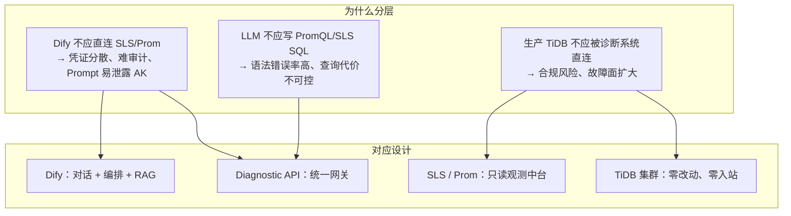

**核心原则：把「会变化的」和「必须稳定的」分开。**

- **会变化的**：Prompt 调优、工具组合、报告模板、知识库内容 → 放在 **Dify**，迭代成本低。
- **必须稳定的**：鉴权、审计、限流、脱敏、集群映射、查询边界 → 放在 **Diagnostic API**，统一管控。
- **已有且成熟的**：日志采集、指标 scrape → **复用** SLS / Prometheus，不重复建设。

#### 3.2.3 选型逻辑：为什么是这个组合

| 选型 | 替代方案（未采用） | 选择理由 |
|------|-------------------|----------|
| **Dify Agent** | 自研 Chat UI + 编排引擎 | 客户已有 Dify 自托管；Agent / Tool / RAG 一体化，交付快 |
| **Diagnostic API（Go）** | Dify 直连 SLS/Prom | 统一安全边界；封装 PromQL/SLS 复杂度；返回摘要降低 Token 消耗 |
| **阿里 SLS** | 自建 ELK / 直连节点 grep | 客户已有 Logtail 采集；诊断系统只读 API，不触达生产 |
| **Prometheus** | 直连 TiDB Dashboard / TiDB 端口 | 复用已有 scrape；指标趋势是故障时间线对齐的关键证据 |
| **离线 MD 知识库** | 联网同步官方文档 | Dify 平台约束；内网环境；v1 控制范围与版本（v7.5.6） |
| **千问（内网）** | 公有云 API | 满足合规；Function Calling 支持工具调用 |

#### 3.2.4 渐进式交付：先可用、再增强

v1 不追求「一次做完所有能力」，而是按风险与价值排序：

1. **P1–P2**：Diagnostic API + Dify 联调 → 先跑通「日志 + 指标 + 慢查 + 对话」主链路。
2. **P3**：知识库 + 标准诊断流程 → 从「能查数据」升级到「能出全面报告」。
3. **P4**：SLS 慢查结构化 → 解决 raw 解析性能瓶颈，**仍不触达生产 TiDB**。
4. **v2+**：告警联动、Dashboard 代理、文档 ETL 等 → 在 v1 稳定后再扩展。

### 3.3 各模块职责与设计缘由

下表汇总架构图中各模块的 **作用** 与 **为什么这么设计**；详细接口与配置见 §4。

| 模块 | 作用 | 为什么这么设计 |
|------|------|----------------|
| **用户（运维/DBA）** | 提供故障线索（错误日志文本/截图、延迟异常时间段、现象与变更描述等），接收诊断报告 | 真实故障常始于业务报错或截图；用户线索锚定排查方向，不要求用户会写 PromQL 或 SLS SQL |
| **Dify Agent** | 按标准流程调度工具、检索知识库、生成结构化报告 | 把诊断方法论固化进 Prompt + 工具编排；与业务迭代解耦，便于调优 |
| **Dify 知识库 RAG** | 提供 TiDB v7.5 官方 Troubleshooting、错误码、性能调优等权威依据 | 弥补 LLM 训练数据滞后；离线 MD 导入适配 Dify 平台约束与内网环境 |
| **Dify 自定义工具** | 将 Diagnostic API 以 OpenAPI 形式暴露给 Agent（Function Calling） | 让模型「按需取数」而非一次性灌入全量日志；控制 Token 与查询成本 |
| **千问 API（内网）** | Agent 主推理；Embedding/Rerank 支撑知识库检索 | 满足合规；122B 主模型 + 4B Embedding/Rerank 在效果与成本间平衡 |
| **Diagnostic API** | 统一网关：鉴权、审计、限流、脱敏、适配 SLS/Prom、返回摘要 | **安全与查询能力的唯一收口**；Dify 不持有 SLS AK/SK，不直连观测中台 |
| **SLS Adapter** | 封装 GetLogs / SQL，映射 cluster → project/logstore | 屏蔽 SLS 查询语法差异；统一时间范围、行数、关键词等边界 |
| **Prom Adapter** | 封装 PromQL 即时/范围查询 | 避免 LLM 直接写 PromQL 出错；支持预置模板降低误查风险 |
| **Slow Log Parser** | 解析 SLS 原始慢日志（JSON/多行） | 客户慢日志暂未结构化；v1 在 API 侧解析，**不依赖直连 TiDB 慢查表** |
| **Summarizer** | 日志/慢查截断、聚合、生成 insights | 原始日志量远超 LLM 上下文；摘要 + insights 是「可推理」的数据形态 |
| **Security / Audit** | API Key、RBAC、限流、脱敏、全链路审计 | 合规可追溯；每次诊断请求可关联到对话、操作者与集群 |
| **阿里 SLS** | 运行日志、慢日志的存储与检索 | 客户已有 Logtail 单向采集；诊断只读查询，**无入站、无 SSH** |
| **Prometheus** | TiDB/TiKV/PD 等指标的趋势与异常检测 | 指标时间精度高，与日志 ERROR 时间对齐；复用已有 Exporter scrape |
| **Vault / 配置** | 集群映射、SLS AK/SK、Prom URL、版本信息 | 密钥与映射集中管理；Diagnostic API 统一读取，不分散到 Dify |
| **Logtail / Exporter** | 已有单向采集：日志 → SLS，指标 → Prom | **零改动生产**：诊断系统不部署新 Agent 到 TiDB 节点 |
| **生产 TiDB 集群** | 被观测对象；诊断系统 **不直连** | 核心约束「不影响生产主要服务组件」；避免诊断本身引入故障面 |

#### 3.3.1 Dify 层：编排与推理，不碰数据凭证

**作用**：承载用户对话、标准诊断流程（§4.5）、工具调用与 RAG 检索，输出九段式报告。

**设计缘由**：

- Dify 擅长 **应用编排与 Prompt 迭代**，但不适合作为 SLS/Prom 凭证的持有方——凭证一旦写入 Dify Tool 配置或 Prompt，审计与轮换都变困难。
- Agent + Function Calling 让模型 **按阶段取数**（先 health → 再 logs → 再 slow_query），比「一次性拉全量日志」更省 Token、更聚焦。
- RAG 与工具并列：工具提供 **本次故障的实时证据**，RAG 提供 **官方排查路径**，二者在 Prompt 阶段 4 强制融合（§4.5.2）。

#### 3.3.2 Diagnostic API 层：安全网关 + 数据适配器

**作用**：Dify 与观测中台之间的 **唯一桥梁**；对外 REST，对内适配 SLS/Prom/Vault。

**设计缘由**：

- **单一信任边界**：所有「读生产相关数据」的操作都经过 API Key + RBAC + 审计，便于安全评审与合规留痕。
- **查询可控**：限流（SLS ≤60 次/分、慢查 ≤10 次/分）、单次 ≤500 行 / 512KB、5 分钟缓存——防止 Agent 或 Prompt 误触发大查询拖垮 SLS 或撑爆 LLM 上下文。
- **返回可推理**：不仅返回原始 entries，还返回 `summary`、`insights`、`suggested_rag_queries`（§4.5.5），减轻 Agent 从海量日志中「自己找规律」的负担。
- **Go 实现**：适合高并发只读网关；与客户现有内网服务栈一致。

#### 3.3.3 SLS 层：运行日志与慢日志的证据源

**作用**：提供故障时间线上的 **文本证据**——ERROR/panic、超时、慢 SQL、组件级异常。

**设计缘由**：

- 客户 **已有** Logtail → SLS 链路，复用即可，无需 SSH 到 TiDB/TiKV 节点 grep。
- 运行日志定位 **错误码与组件**；慢日志定位 **Top SQL 与 Cop/索引问题**——二者互补，对应 §4.5.3 不同故障分类。
- 慢日志 **两阶段策略**（§4.3.2）：P2 先在 API 解析 raw（快速上线）；P4 再在 SLS 侧加工 parsed（性能增强）——均不直连 TiDB `INFORMATION_SCHEMA.CLUSTER_SLOW_QUERY`。

#### 3.3.4 Prometheus 层：量化异常与趋势对齐

**作用**：提供 **可量化的健康快照**——QPS、P99、连接数、TiKV 写入/锁、PD Region 健康等。

**设计缘由**：

- 日志告诉你「发生了什么错误」，指标告诉你 **「何时开始、影响多大、是否仍在持续」**——融合分析必须时间对齐（§4.5.2）。
- 只读 Prom HTTP API，**不新增 scrape target**，不改变生产监控拓扑。
- 预置 PromQL 模板（§4.4.3）：Agent 传 `metric_name` 而非手写 PromQL，降低查错集群、语法错误的风险。

#### 3.3.5 知识库 RAG：权威依据层，与观测数据并列

**作用**：为 Agent 提供 TiDB v7.5 官方排查路径、错误码解释、参数与调优建议。

**设计缘由**：

- 仅靠 LLM「记忆」容易过时或与 v7.5.6 生产环境不符；RAG 把 **官方文档** 作为可检索依据，约束建议范围。
- **离线 Markdown 导入**（§2.4）：适配 Dify 平台能力与客户内网；文档清单固定为 §4.1.4.2，与 v7.5.6 版本策略一致。
- L1 公开文档占比 ≥70%（§4.1.4.1），确保修复建议与 PingCAP 官方思路一致；L3 内部案例补充客户环境差异。

#### 3.3.6 标准诊断流程（跨模块方法论）

**作用**：定义 Agent 必须遵循的 SOP（§4.5）——解析用户线索 → 现象澄清 → 健康快照 → 分类排查 → RAG 检索 → 融合分析 → 九段式报告。

**设计缘由**：

- 无固定流程时，LLM 容易 **跳过取数步骤** 或 **只看单一数据源** 就下结论。
- 故障分类表（§4.5.3）把「现象 → 工具 → 指标 → RAG 关键词」预映射，减少 Agent 盲目检索。
- 置信度与反证要求（§4.5.2）避免「单条 ERROR 日志 = 根因」的过度推断。

#### 3.3.7 安全与审计（横切能力）

**作用**：贯穿 Dify → Diagnostic API → SLS/Prom 全链路；认证、授权、审计、脱敏。

**设计缘由**：

- 诊断系统会接触 **生产日志与 SQL 文本**，必须在进入 LLM 前脱敏（§7.3）。
- 审计日志与 Dify 对话通过 `request_id` / `conversation_id` 关联（§7.2），满足「谁在何时查了哪个集群」的合规要求。
- v1 **只读、不执行修复**（§1.4）：诊断建议与实际操作分离，降低误操作风险。

#### 3.3.8 模块协作关系（一次完整诊断）

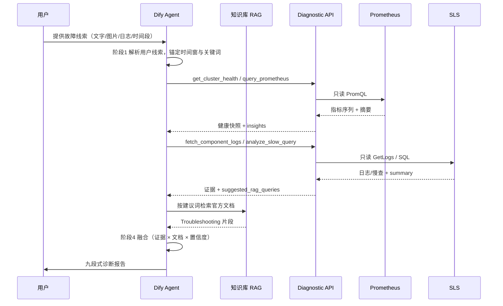

**要点**：用户只与 Agent 交互；Agent 只与 Diagnostic API、知识库交互；Diagnostic API 只与 SLS/Prom 交互——**生产 TiDB 不在调用链上**。

---

## 4. 分层设计

### 4.1 Dify Agent 层

#### 4.1.1 应用类型与用户输入

- **主应用**：Agent 应用（Chat 模式），支持 **文字 + 文件/图片上传**（依赖 Dify 与千问多模态能力）
- **可选**：Workflow 应用「标准采集流程」发布为 Tool，供复杂场景固定编排

**用户侧故障线索**（详见 §1.5）是对话入口，常见包括：

- 粘贴的应用/TiDB **错误日志**（文本）
- **错误日志截图**、告警截图、监控曲线截图（图片）
- **延迟或异常时间段**描述（如「14:30 起 P99 升高，持续约 15 分钟」）
- 业务现象、影响范围、近期变更等文字说明

Agent 在调用 Diagnostic API **之前**，须先从用户输入中提取：**故障起止时间、集群/库/业务范围、错误码或关键词、是否变更**，用于后续工具参数与 RAG 检索。

#### 4.1.2 工具清单（OpenAPI 导入）

| 工具名 | 功能 | 数据源 |
|--------|------|--------|
| `fetch_component_logs` | 按集群/组件/时间/关键词查运行日志 | SLS runtime logstore |
| `analyze_slow_query` | 慢查询 Top N、聚合分析 | SLS slow logstore（raw/parsed） |
| `query_prometheus` | PromQL 查指标 | Prometheus |
| `get_cluster_health` | 集群健康摘要（组合 Prom + 可选 Dashboard） | Prometheus 为主 |
| `get_recent_alerts` | 近期告警（可选） | Alertmanager |

#### 4.1.3 Agent Prompt 要点

```markdown
# 角色
你是 TiDB 数据库故障诊断专家，遵循 PingCAP/TiDB 官方排查思路，结合实时观测数据给出全面诊断。

# 数据边界
- 目标 TiDB 版本：**v7.5.6**（固定，无需向用户确认版本）
- 日志与慢查来自 SLS，指标来自 Prometheus，不连接 TiDB / TiKV / PD / TiFlash 等主要服务组件
- 数据可能有 1–3 分钟延迟，报告中需注明数据时间范围
- 知识库以 TiDB 公开文档为主；引用时须给出 **文档主题/章节**
- 用户可能提供 **错误日志（文本/图片）、异常时间段、现象描述**（§1.5）；须先解析再查 SLS/Prom，并在报告中区分「用户提供」与「系统拉取」证据

# 标准诊断流程（必须按序执行，可跳过无数据步骤但需说明）
## 阶段 1：现象澄清（含用户线索解析）
- 解析用户输入：错误日志文本/截图、延迟异常时间段、业务现象、变更信息
- 从日志或图片中提取：错误码、关键词、组件、**建议查询时间窗口**（start/end）
- 确认：影响范围（集群/库/业务）；若时间或集群不明确，向用户追问 1–2 个关键问题
- 用户线索仅作 **排查锚点**；结论须用 SLS/Prom 数据验证或标注「待验证」

## 阶段 2：健康快照
- 调用 get_cluster_health + query_prometheus（QPS、P99、连接数、TiKV/PD 关键指标）
- 判断：整体可用性、资源瓶颈、指标异常时间点是否与故障吻合

## 阶段 3：分类排查（按故障类型选路径）
| 类型 | 优先工具 | 知识库检索方向 |
|------|----------|----------------|
| 连接/超时/不可用 | fetch_component_logs(tidb) + 连接数指标 | connection, timeout, 9005 |
| 性能/延迟 | analyze_slow_query + tidb_p99/tikv 指标 | slow query, optimizer, index |
| 写入/TiKV | tikv 日志 + write/scheduler 指标 | tikv, raft, disk, latch |
| Region/调度 | PD 相关指标 + pd 日志 | region, leader, scheduler |
| 锁/事务 | 慢查 + tidb/tikv 日志 | lock, deadlock, transaction |

## 阶段 4：融合分析
- 将 **用户线索**、工具返回的数据与知识库检索结果 **交叉对照**
- 每条根因假设需标注：支持证据 / 反对证据 / 置信度（高/中/低）
- 禁止仅凭单一日志行或文档段落下结论

## 阶段 5：全面建议输出
- 给出：紧急止血 → 根因修复 → 验证步骤 → 预防复盘
- 修复步骤需参考官方文档做法，标注风险等级
- 无法确认根因时，给出优先级排序的「下一步排查清单」

# 输出格式（必须使用）
## 1. 故障摘要
## 2. 现象与时间线
## 3. 健康快照（指标摘要）
## 4. 证据链
   - 4.0 用户提供的故障线索（原文/截图摘要、时间段）
   - 4.1 监控指标（含时间范围）
   - 4.2 运行日志（含组件与条数）
   - 4.3 慢查询（如有）
   - 4.4 知识库依据（引用主题/章节）
## 5. 根因分析（含置信度）
## 6. 修复建议
   - 6.1 紧急处理（低风险优先）
   - 6.2 根因修复
   - 6.3 验证方法
## 7. 预防与优化建议
## 8. 后续排查路径（若根因未确认）
## 9. 数据时效与局限性说明

# 约束
- 不臆测；结论需有多源证据或明确标注「待验证」
- 涉及重启、缩容、杀会话、改配置等操作：仅建议，标注风险，不声称已执行
- 优先引用 TiDB 官方排查路径；与观测数据不一致时说明差异
```

#### 4.1.4 TiDB 公开资料 RAG 知识库

RAG 库是诊断 **权威依据层**，与 SLS/Prometheus **观测数据层** 并列，共同支撑全面诊断。

> **平台约束（Dify）**：当前 Dify 知识库 **仅支持离线 Markdown 导入**，不支持联网抓取或定时同步。TiDB 公开文档须在外部环境导出为 Markdown 并完成分块后，再 **手动上传** 至 Dify。

##### 4.1.4.1 知识库定位

| 层级 | 内容 | 来源 |
|------|------|------|
| **L1 官方公开文档（主体）** | Troubleshooting、FAQ、错误码、监控指标说明 | TiDB / PingCAP 公开站点 |
| **L2 版本与组件专题** | v7.5.6 Release Note、TiKV/PD/TiFlash 专题 | 官方文档 + GitHub Release v7.5.6 |
| **L3 内部补充（可选）** | 客户运维手册、历史故障案例、内部基线 | 客户提供 |
| **L4 指标释义（辅助）** | Grafana Dashboard 指标说明、PromQL 与 TiDB 组件映射 | 官方监控文档 + 内部整理 |

> **原则**：L1 占比 ≥ 70%，确保建议与 TiDB 官方排查思路一致；L3 用于补充客户环境差异。

##### 4.1.4.2 建议入库的 TiDB 公开资料清单

下表为 **v7.5.6 入库清单**；文档链接统一使用 PingCAP **v7.5** 文档线（与 v7.5.6 补丁版对应）。

| 分类 | 文档主题 | URL | 诊断用途 |
|------|----------|------------------------|----------|
| 故障排查 | TiDB 集群故障排查总览 | https://docs.pingcap.com/tidb/v7.5/troubleshoot-tidb-cluster | 集群级排查总入口 |
| 集群诊断 | TiDB Dashboard 简介 | https://docs.pingcap.com/tidb/v7.5/dashboard/dashboard-intro | Dashboard 诊断能力 |
| 集群诊断 | Statement Summary 表 | https://docs.pingcap.com/tidb/v7.5/statement-summary-tables | 慢 SQL、集群负载 |
| 错误码 | TiDB 错误码参考 | https://docs.pingcap.com/tidb/v7.5/error-codes | 日志/error 快速映射 |
| 性能 | 识别慢查询 | https://docs.pingcap.com/tidb/v7.5/identify-slow-queries | 慢查分析 |
| 性能 | SQL 性能优化 | https://docs.pingcap.com/tidb/v7.5/sql-tuning-overview | SQL/索引优化建议 |
| TiKV | TiKV 故障排查 | https://docs.pingcap.com/tidb/v7.5/troubleshoot-tikv | TiKV 延迟/写入问题 |
| PD | PD 故障排查 | https://docs.pingcap.com/tidb/v7.5/troubleshoot-pd | Region/调度类故障 |
| 事务与锁 | 锁冲突与锁管理 | https://docs.pingcap.com/tidb/v7.5/lock-management | 锁等待、事务超时 |
| 运维 | TiUP 概述 | https://docs.pingcap.com/tiup/v1.14/tiup-overview | TiUP 运维与变更 |
| 运维 | TiUP 集群部署与管理 | https://docs.pingcap.com/tiup/v1.14/maintain-tidb-using-tiup | 扩缩容、升级相关故障 |
| 监控 | TiDB 监控指标 | https://docs.pingcap.com/tidb/v7.5/tidb-monitoring-metrics | 指标解读与 Prom 对照 |
| 监控 | TiKV 监控指标 | https://docs.pingcap.com/tidb/v7.5/tikv-metrics | TiKV 指标释义 |
| 配置 | TiDB 配置项 | https://docs.pingcap.com/tidb/v7.5/tidb-configuration-file | tidb.toml 相关 |
| 配置 | TiKV 配置项 | https://docs.pingcap.com/tidb/v7.5/tikv-configuration-file | tikv.toml 相关 |
| 配置 | PD 配置项 | https://docs.pingcap.com/tidb/v7.5/pd-configuration-file | pd.toml 相关 |
| 版本说明 | TiDB v7.5.6 Release | https://github.com/pingcap/tidb/releases/tag/v7.5.6 | 已知问题与变更 |

**版本策略（v1 固定）**：

- 客户生产版本：**v7.5.6**
- RAG 仅维护 **一套** v7.5 文档 + v7.5.6 Release Note，**不支持多版本并存**
- 所有分块元数据统一标注 `version: v7.5.6`
- Agent Prompt 固定声明目标版本，不做跨版本文档检索

**文档来源范围（v7.5.6）**：

- PingCAP TiDB 文档：`https://docs.pingcap.com/tidb/v7.5/...`
- PingCAP TiUP 文档：`https://docs.pingcap.com/tiup/v1.14/...`（与 TiUP 部署 v7.5.6 常用版本对齐，入库时按客户实际 TiUP 版本确认）
- GitHub Release：`https://github.com/pingcap/tidb/releases/tag/v7.5.6`

##### 4.1.4.3 知识库构建与更新（离线 Markdown 导入）

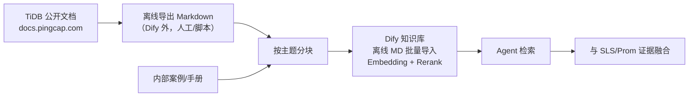

| 步骤 | 说明 |
|------|------|
| 采集 | **离线**从 PingCAP 文档站导出 Markdown（浏览器保存、人工复制、外部脚本等）；**不支持 Dify 内 URL 抓取或定时同步**；按 §4.1.4.2 清单选取文档 |
| 分块 | 按「故障场景 + 组件 + 错误码」分块，单块 500–1500 字 |
| 入库 | 将分块后的 Markdown 文件 **批量上传** 至 Dify 知识库；**不支持** URL / API / 在线数据源自动入库 |
| 索引 | Qwen3-Embedding-4B + Qwen3-Reranker-4B；Top-K=5，Rerank 后取 Top-3 |
| 元数据 | 建议标注：`doc_title`、`version`、`component`、`symptom_tags` |
| 更新 | **人工触发**：外部重新导出 → 分块 → Dify **重新导入 / 覆盖**；建议每季度复核 **v7.5.6** 对应文档内容；客户升级 TiDB 大版本时另起迭代 |

**分块内容格式示例**：

```markdown
[标题] Error 9005: Region is unavailable
[版本] v7.5.6
[组件] tidb

Region 不可用通常与 TiKV/PD 故障或网络分区相关……
```

##### 4.1.4.4 RAG 检索策略（与诊断流程联动）

Agent 在每个诊断阶段应 **主动检索** 知识库，而非仅在最后查文档：

| 诊断阶段 | 检索 Query 示例 | 目的 |
|----------|-----------------|------|
| 现象澄清 | 「TiDB 连接超时 常见原因」 | 缩小排查方向 |
| 见错误码 | 「TiDB error 9005 Region is unavailable」 | 错误码 → 排查路径 |
| 性能问题 | 「慢查询 Cop_time 高 TiKV 扫描」 | SQL/索引优化建议 |
| 见 TiKV 指标异常 | 「tikv scheduler latch wait 高」 | 组件级排查 |
| 输出建议前 | 「{根因假设} TiDB 官方 修复步骤」 | 验证建议与官方一致 |

##### 4.1.4.5 知识库质量验收

- [ ] 全部内容经 **离线 Markdown 批量导入** Dify，无 URL / 定时同步依赖
- [ ] 覆盖 Top 20 常见 TiDB 错误码及官方说明
- [ ] 覆盖连接/性能/TiKV/PD/锁 五类场景的 Troubleshooting 章节
- [ ] 给定错误码或现象，Rerank 后 Top-3 命中相关文档
- [ ] Agent 报告「知识库依据」章节 **逐条列出文档标题/章节**

---

### 4.2 Diagnostic API 层

#### 4.2.1 职责

| 模块 | 职责 |
|------|------|
| SLS Adapter | 封装 GetLogs / SQL 查询，映射 cluster → project/logstore |
| Prom Adapter | 封装 PromQL 即时/范围查询 |
| Slow Log Parser | 解析 SLS 原始慢日志（JSON 行 / 多行文本） |
| Summarizer | 日志/慢查截断、聚合、生成 insights |
| Security | API Key、RBAC、限流、脱敏 |
| Audit | 全量请求审计 |

#### 4.2.2 集群配置示例

```yaml
clusters:
  prod-01:
    display_name: "生产集群-01"
    tidb_version: v7.5.6          # 固定，v1 仅支持此版本
    doc_line: v7.5                # RAG 文档线，对应 PingCAP v7.5 文档
    sls:
      project: tidb-prod
      logstores:
        runtime: tidb-runtime
        slow: tidb-slow
        slow_parsed: tidb-slow-parsed   # 可选，SLS 加工后启用
      default_tag:
        cluster: prod-01
    prometheus:
      url: http://prometheus.internal:9090
      # 可选：预置常用 PromQL 模板
      metric_templates:
        tidb_qps: 'sum(rate(tidb_server_query_total{cluster="prod-01"}[5m]))'
        tidb_p99: 'histogram_quantile(0.99, sum(rate(tidb_server_handle_query_duration_seconds_bucket{cluster="prod-01"}[5m])) by (le))'
        tikv_write_lag: '...'
```

#### 4.2.3 核心 API 定义

**POST /api/v1/logs/fetch**

```json
// Request
{
  "cluster_id": "prod-01",
  "component": "tidb",
  "keyword": "timeout",
  "level": "ERROR",
  "start_time": "2026-08-20T14:25:00+08:00",
  "end_time": "2026-08-20T14:35:00+08:00",
  "limit": 500
}

// Response
{
  "cluster_id": "prod-01",
  "source": "sls",
  "matched_lines": 47,
  "truncated": false,
  "data_delay_hint": "SLS 采集延迟约 1-3 分钟",
  "entries": [
    {
      "timestamp": "2026-08-20T14:30:01+08:00",
      "host": "10.0.1.12",
      "level": "ERROR",
      "message": "connection timeout ..."
    }
  ],
  "summary": "47 条 ERROR，关键词 timeout(32), connection(15)"
}
```

**GET /api/v1/slow-query/analyze**

```
?cluster_id=prod-01&time_range=1h&min_query_time=1&top_n=10&db=orders
```

```json
// Response
{
  "cluster_id": "prod-01",
  "source": "sls",
  "parse_mode": "raw|parsed",
  "time_range": "1h",
  "total_slow_queries": 156,
  "top_queries": [
    {
      "digest": "abc123...",
      "query": "SELECT ... FROM orders ...",
      "count": 45,
      "avg_query_time_sec": 3.2,
      "max_query_time_sec": 8.1,
      "db": "orders",
      "index_names": "idx_order_time"
    }
  ],
  "insights": [
    "Top1 SQL 占慢查询 45%，Cop_time 偏高"
  ]
}
```

**POST /api/v1/metrics/query**

```json
// Request
{
  "cluster_id": "prod-01",
  "query": "histogram_quantile(0.99, ...)",
  "start": "2026-08-20T14:00:00+08:00",
  "end": "2026-08-20T15:00:00+08:00",
  "step": "1m"
}

// Response
{
  "cluster_id": "prod-01",
  "source": "prometheus",
  "series": [...],
  "summary": "P99 在 14:28 升至 2.3s，14:35 回落"
}
```

**GET /api/v1/cluster/health**

组合 Prometheus 关键指标 + 规则引擎，返回结构化健康摘要（无需直连 TiDB）。

---

### 4.3 阿里 SLS 层

#### 4.3.1 运行日志

- **来源**：客户已有 Logtail 采集 tidb/tikv/pd 运行日志
- **要求**：logstore 建议带 `cluster`、`component`、`host` 标签/字段并建索引
- **Diagnostic API**：按时间 + 标签 + 关键词查询，单次 ≤500 行 / 512KB

**SLS 查询示例**：

```text
cluster: prod-01 AND component: tidb AND (ERROR OR timeout)
| SELECT __time__, host, content
  ORDER BY __time__ DESC
  LIMIT 500
```

#### 4.3.2 慢日志

**阶段一（PoC）— API 侧解析**

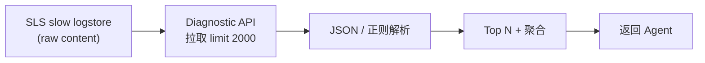

**阶段二（生产）— SLS 加工结构化**

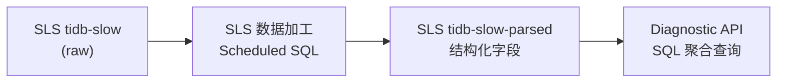

建议解析字段：`Time`, `Query_time`, `Digest`, `Query`, `DB`, `Index_names`, `Cop_time`, `Process_time`, `Mem_max`

#### 4.3.3 SLS 权限

- RAM 子账号仅授予目标 Project 的 `log:GetLogs`、SQL 查询权限
- AK/SK 存 Vault，由 Diagnostic API 持有，**不进入 Dify**

---

### 4.4 Prometheus 层

#### 4.4.1 定位

- 指标查询**不增加对 TiDB 生产的新连接**（复用已有 scrape）
- Diagnostic API 只读 Prometheus HTTP API

#### 4.4.2 常用诊断指标

| 类别 | 指标示例 | 用途 |
|------|----------|------|
| TiDB 流量 | `tidb_server_query_total` | QPS 变化 |
| TiDB 延迟 | `tidb_server_handle_query_duration_seconds` | P99/P95 |
| TiDB 连接 | `tidb_server_connections` | 连接池、超时 |
| TiKV 写入 | `tikv_engine_write_duration_seconds` | 写入延迟 |
| TiKV 锁 | `tikv_scheduler_latch_wait_duration_seconds` | 锁等待 |
| PD | `pd_cluster_status`, `pd_region_health` | 集群/Region 健康 |
| 资源 | `node_cpu`, `node_disk_io` | 宿主机瓶颈 |

#### 4.4.3 预置模板

Diagnostic API 内置常用 PromQL 模板，Agent 传 `metric_name` 即可，降低 PromQL 错误率：

```json
{
  "cluster_id": "prod-01",
  "metric": "tidb_p99",
  "start": "...",
  "end": "..."
}
```

---

### 4.5 标准诊断方法论与融合流程

本节定义 Agent 的 **标准作业流程（SOP）**，确保每次诊断均：**用全量已有数据、引权威文档、给全面建议**。

#### 4.5.1 诊断总流程

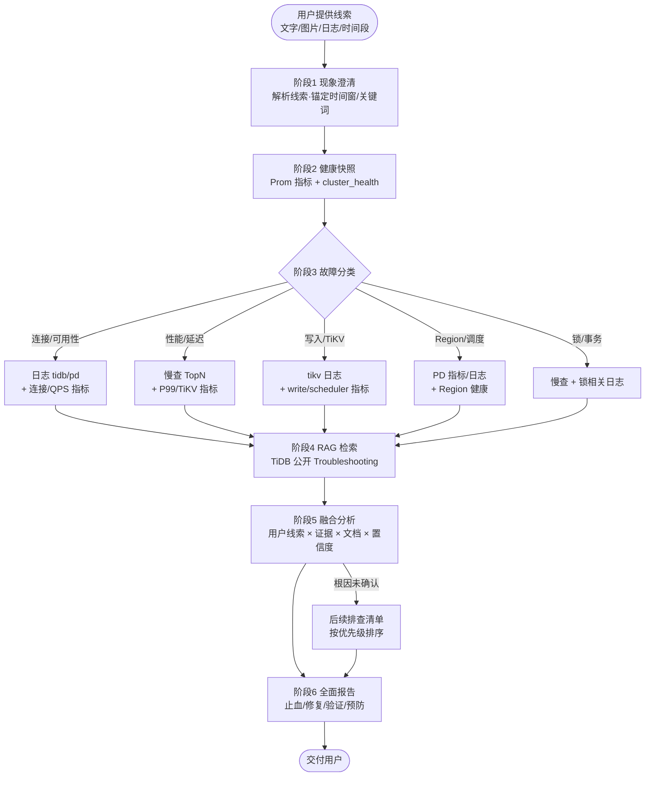

#### 4.5.2 多源数据融合规则

Agent 与 Diagnostic API 协同，按以下规则组织证据：

| 证据类型 | 来源 | 在报告中的作用 |
|----------|------|----------------|
| **用户故障线索** | 用户对话（文字/图片/粘贴日志/时间段描述） | 锚定排查方向、时间窗口、关键词；须在后续 SLS/Prom 中验证 |
| 指标趋势 | Prometheus | 确认异常时间点、量化影响、排除/确认资源瓶颈 |
| 运行日志 | SLS runtime | 定位 error/panic/超时、错误码、组件 |
| 慢查询 | SLS slow | 定位 Top SQL、索引/扫描/Cop 问题 |
| 告警（可选） | Alertmanager | 与故障时间对齐，补充已知规则命中项 |
| 规则 insights | Diagnostic API 摘要 | API 预生成的统计结论（如「Top1 SQL 占 45%」） |
| 知识库 | TiDB 公开 RAG | 提供官方排查路径、修复步骤、参数建议 |

**融合原则**：

1. **时间对齐**：用户描述的异常时间段、指标异常、日志 ERROR、慢查峰值须在同一时间窗口内对照。
2. **组件闭环**：TiDB 延迟升高 → 同时看 TiDB 连接 + TiKV Cop/Write + PD 调度，避免单组件结论。
3. **文档校验**：修复建议须与 RAG 检索到的官方步骤一致；若观测与文档矛盾，报告中说明。
4. **置信度标注**：高（≥2 类证据一致）、中（单类强证据 + 文档吻合）、低（仅推测）→ 低置信度必须给出验证步骤。

#### 4.5.3 故障分类与工具 / 知识库映射

| 故障分类 | 典型现象 | 必调工具 | 必查 Prom 指标 | RAG 检索关键词 |
|----------|----------|----------|----------------|----------------|
| 可用性 | 连接失败、超时、9005 | logs(tidb,pd), health | connections, QPS, region_health | connection timeout, Region unavailable |
| 读性能 | 查询慢、P99 升高 | slow_query, tidb_p99 | handle_query_duration, coprocessor | slow query, index, coprocessor |
| 写性能 | 写入慢、commit 慢 | slow_query, logs(tikv) | write_duration, raft, latch | tikv write, raft, disk io |
| 资源 | CPU/磁盘/内存高 | health, 资源类 metric | node_cpu, disk_io, memory | resource, oom, disk full |
| 调度 | Region 异常、Leader 缺失 | logs(pd), health | region_health, pending_peer | region, leader, scheduler |
| 锁与事务 | 锁等待、deadlock | slow_query, logs(tidb,tikv) | lock_wait, transaction | lock, deadlock, large transaction |
| 变更引发 | 发布后故障 | logs(全组件), health | 变更前后指标对比 | upgrade, deploy, config change |

#### 4.5.4 全面诊断报告要素（检查清单）

交付前 Agent 输出须满足：

- [ ] **用户线索**：是否记录用户提供的错误日志/截图/时间段，并说明如何用于锚定排查
- [ ] **故障摘要**：一句话说明影响
- [ ] **时间线**：故障起止、指标/日志异常时间点
- [ ] **健康快照**：关键指标当前值与趋势
- [ ] **分类路径**：说明按哪类故障排查及原因
- [ ] **证据链**：用户线索 + 指标 + 日志 + 慢查 + 知识库，分项列出并区分来源
- [ ] **根因分析**：含置信度与反证说明
- [ ] **修复建议**：紧急止血 → 根因修复 → 验证步骤（分优先级与风险）
- [ ] **预防建议**：监控、索引、配置、容量等
- [ ] **后续排查**：根因未确认时的 Next Steps
- [ ] **数据时效**：SLS/Prom 延迟与查询时间范围

#### 4.5.5 Diagnostic API 对融合分析的支撑

Diagnostic API 除返回原始数据外，应提供 **面向融合的摘要字段**，减轻 Agent 拼装负担：

| API 响应字段 | 说明 |
|--------------|------|
| `summary` | 自然语言摘要（条数、关键词分布、峰值时间） |
| `insights` | 规则引擎结论（如 Cop_time 偏高、ERROR 集中在某 host） |
| `anomaly_window` | 建议重点分析的时间窗口 |
| `suggested_rag_queries` | 推荐给 Agent 的知识库检索词（错误码、组件、现象） |
| `related_metrics` | 建议联动查询的 Prom 模板名 |

示例（`fetch_component_logs` 响应扩展）：

```json
{
  "summary": "47 条 ERROR，timeout(32)，集中在 10.0.1.12",
  "anomaly_window": {"start": "2026-08-20T14:28:00+08:00", "end": "2026-08-20T14:32:00+08:00"},
  "suggested_rag_queries": ["TiDB connection timeout", "tidb_server_connections 高"],
  "related_metrics": ["tidb_connections", "tidb_p99", "tikv_scheduler_latch"]
}
```

---

## 5. 典型诊断数据流（示例）

### 5.1 场景：连接超时

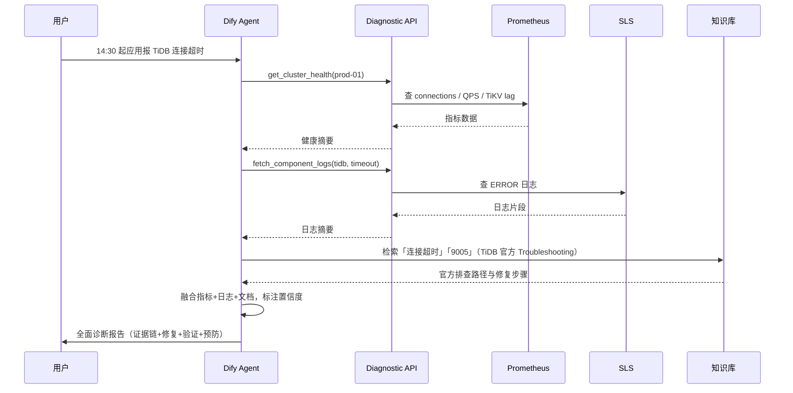

### 5.2 场景：查询变慢

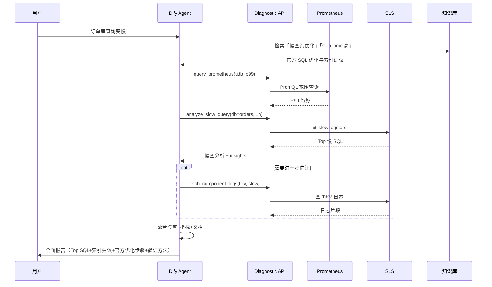

---

## 6. 不影响生产主要服务组件的保障措施

| 层级 | 措施 |
|------|------|
| 网络 | Diagnostic API / Dify 与 TiDB / TiKV / PD / TiFlash 等服务端口隔离；无 4000/2379/20180 SSH 访问 |
| 日志 | 只读 SLS API；不 SSH grep 生产日志文件 |
| 慢查 | 只读 SLS；不直连生产 `cluster_slow_query`（除非客户后续明确允许 RO） |
| 指标 | 只读 Prometheus；不新增 scrape target |
| 采集 | 复用已有 Logtail，诊断系统不部署新 Agent 到生产（除非客户主动优化 SLS 字段） |
| 限流 | API Key 限流；SLS 查询 ≤60 次/分钟/Key；慢查 ≤10 次/分钟 |
| 数据量 | 单次响应 ≤512KB；日志 ≤500 行；慢查 raw 拉取 ≤2000 条 |
| 缓存 | 相同查询 5 分钟内返回缓存（降低 SLS 读费用与负载） |
| 操作 | v1 只读诊断，不执行任何写操作 |

---

## 7. 安全与审计

### 7.1 认证授权

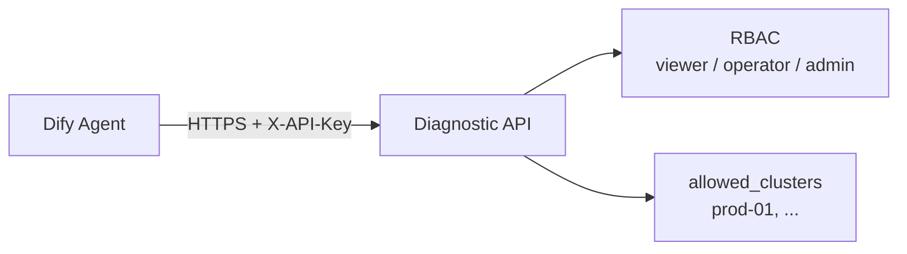

| 角色 | 权限 |
|------|------|
| viewer | 日志、慢查、指标查询（Dify 默认） |
| operator | + 更大时间范围、更高 limit |
| admin | API Key 管理、集群配置 |
| auditor | 只读审计日志 |

### 7.2 审计日志

每条 API 请求记录：

```json
{
  "timestamp": "2026-08-20T14:30:00+08:00",
  "request_id": "uuid",
  "source": "dify",
  "dify_app_id": "xxx",
  "dify_conversation_id": "xxx",
  "api_key_id": "key-abc",
  "cluster_id": "prod-01",
  "tool": "fetch_component_logs",
  "params_redacted": {...},
  "result": "success",
  "duration_ms": 850,
  "sls_read_rows": 47
}
```

- 审计日志独立存储，保留 ≥180 天（可按客户合规调整）
- 与 Dify 对话记录通过 `request_id` / `conversation_id` 关联

### 7.3 数据脱敏

返回 LLM 前正则脱敏：密码、Token、DSN、手机号、身份证等。

---

## 8. 交付阶段与里程碑

### 8.1 阶段总览

| 阶段 | 周期 | 交付物 | 生产影响 |
|------|------|--------|----------|
| P0 需求确认 | 3 天 | SLS logstore 清单、Prom 指标 label、集群映射表 | 无 |
| P1 Diagnostic API 骨架 | 1 周 | 认证/审计/限流 + Prom 查询 + SLS 运行日志 | 无 |
| P2 慢查 + Dify 联调 | 1 周 | SLS 慢查（raw 解析）+ Dify Agent + 3 工具 | 无 |
| P3 知识库 + Prompt | 1 周 | RAG 离线 MD 导入 + Prompt 调优 + 2 场景演示 | 无 |
| P4 SLS 慢查加工 | 1 周 | SLS parsed logstore + API 切换 | 无（仅 SLS 侧加工） |
| P5 安全评审与上线 | 3 天 | 渗透测试、审计验证、运维手册 | 无 |

**合计：约 4–5 周**

### 8.2 P0 — 需求确认（输入清单）

需客户提供的材料：

- [ ] SLS Project 名称、logstore 名称（runtime / slow）
- [ ] SLS 日志样例（运行日志、慢日志各 2 条，可打码）
- [ ] SLS 字段说明（是否有 cluster/component 标签）
- [ ] Prometheus URL、集群 label 命名（如 `cluster=prod-01`）
- [x] **TiDB 版本**：**v7.5.6**（已确认，RAG 与 Prompt 固定此版本）
- [ ] 客户 TiUP 版本（用于 TiUP 文档链接确认，默认 v1.14）
- [ ] Dify 访问地址、千问 API 接入方式
- [ ] 安全要求文档（审计留存、网络隔离）

### 8.3 P1 — Diagnostic API 基础能力

**交付**：

- [ ] Go 服务骨架（或 Python）
- [ ] API Key 认证 + RBAC
- [ ] 审计日志模块
- [ ] `POST /api/v1/metrics/query`（Prometheus）
- [ ] `GET /api/v1/cluster/health`（Prom 组合指标）
- [ ] `POST /api/v1/logs/fetch`（SLS 运行日志）
- [ ] OpenAPI 3.0 规范文件

**验收**：

- 给定时间范围，可从 SLS 返回 tidb ERROR 日志
- 可从 Prom 返回 QPS、P99 曲线摘要
- 未授权请求返回 401；审计日志可查

### 8.4 P2 — 慢查与 Dify 联调

**交付**：

- [ ] `GET /api/v1/slow-query/analyze`（SLS raw + API 解析）
- [ ] Dify Agent 应用创建
- [ ] OpenAPI 工具导入（logs / slow_query / metrics / health）
- [ ] Agent Prompt v1
- [ ] 千问模型接入（Function Calling 验证）

**验收**：

- 场景 1：连接超时 — Agent 可拉日志 + 指标并输出报告
- 场景 2：查询变慢 — Agent 可拉慢查 Top N + P99 并输出报告

### 8.5 P3 — 知识库与全面诊断流程

**交付**：

- [ ] **离线 Markdown 文档包**（对应 **v7.5.6**）：覆盖 §4.1.4.2 清单中的 Troubleshooting、错误码、性能/TiKV/PD/锁/监控等主题
- [ ] 文档分块与元数据（`doc_title`、`version`、`component`、`symptom_tags`）
- [ ] Dify 知识库 **离线 Markdown 批量导入**（不支持 URL / 定时同步）
- [ ] Qwen3-Embedding + Rerank 配置与检索效果调优
- [ ] Agent Prompt v2（六阶段标准流程 + 九段式报告模板）
- [ ] Diagnostic API 响应扩展：`suggested_rag_queries`、`related_metrics`、`anomaly_window`
- [ ] 内部案例/手册入库（L3，可选）
- [ ] 查询结果缓存（5 分钟）

**验收**：

- [ ] Top 20 错误码检索 Top-3 命中官方说明
- [ ] 五类场景 Troubleshooting 均可检索
- [ ] 3 个历史故障回放：报告「知识库依据」**逐条列出标题/章节**
- [ ] 报告结构符合 §4.5.4 检查清单

### 8.6 P4 — SLS 慢查结构化（生产增强）

**交付**：

- [ ] SLS 慢日志加工规则（JSON 或正则提取）
- [ ] `tidb-slow-parsed` logstore
- [ ] API 切换 `source: parsed`，提升 Top N 性能
- [ ] SLS 索引优化建议文档

**验收**：

- 慢查 Top 10 查询 P95 延迟 < 3s
- 不再依赖大 volume raw 拉取

### 8.7 P5 — 安全评审与上线

**交付**：

- [ ] 安全测试报告（未授权访问、SQL 注入式 keyword、越权 cluster）
- [ ] 运维手册（部署、配置、Key 轮换、故障排查）
- [ ] 用户使用手册（Dify 对话指南：如何粘贴错误日志、上传截图、描述异常时间段）
- [ ] 上线 Checklist

---

## 9. 部署清单

| 组件 | 部署位置 | 规格建议 | 说明 |
|------|----------|----------|------|
| Dify | 已有自托管 | — | 新增 Agent 应用与工具 |
| Diagnostic API | 内网 VM / K8s | 2C4G × 2（HA） | 与 SLS/Prom 同 region |
| 千问 API | 内网模型网关 | — | Dify 与 API 均可访问 |
| Vault / 密钥 | 已有或 K8s Secret | — | SLS AK/SK、API Key |
| 审计日志存储 | 本地盘 + 备份 | ≥100GB/年 | 或对接 SIEM |

**网络要求**：

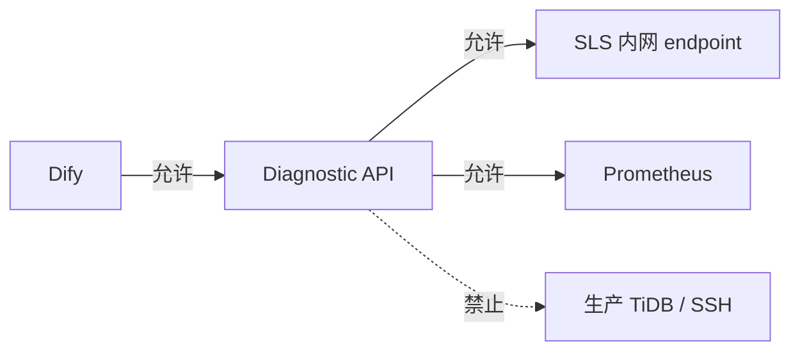

---

## 10. Dify 配置步骤（摘要）

1. **Integrations → Model**：配置内网千问 Qwen3.5-122B；若需识别 **错误日志截图**，确认模型/Dify 应用已开启 **文件/图片上传** 与多模态能力
2. **Knowledge → 创建知识库**：**离线导入** TiDB v7.5 公开文档 Markdown（对应 v7.5.6，按 §4.1.4.2 清单）；**不支持 URL 抓取或定时同步**；选 Qwen3-Embedding + Rerank
3. **Integrations → Tools → 自定义 API**：导入 Diagnostic API OpenAPI
4. **配置 Credential**：Base URL + `X-API-Key`（不写进 Prompt）
5. **创建 Agent 应用**：绑定模型、工具、知识库、Prompt
6. **验证 Agent 模式**：确认为 Function Calling（或 ReAct 降级）
7. **发布**：内网 URL 或嵌入运维门户

---

## 11. 验收标准（总）

| # | 验收项 | 标准 |
|---|--------|------|
| 1 | 主要服务组件隔离 | Diagnostic API 无 TiDB/TiKV/PD/TiFlash 直连、无 SSH 生产节点 |
| 2 | 日志查询 | 指定集群/时间/关键词，30s 内返回 SLS 日志摘要 |
| 3 | 慢查分析 | 1h 内 Top 10 慢 SQL，含 digest/耗时/库名 |
| 4 | 指标查询 | 返回 P99/QPS 等指标及趋势摘要 |
| 5 | Agent 全面报告 | 符合 §4.5.4 九段式结构：含用户线索、证据链、知识库依据、置信度、修复/验证/预防 |
| 6 | RAG 知识库 | Top 20 错误码 + 五类 Troubleshooting 可检索；**离线 MD 导入**；报告含知识库依据 |
| 7 | 安全 | API Key 鉴权、越权拒绝、审计可追溯 |
| 8 | 脱敏 | 日志/SQL 中无明文密码/Token |
| 9 | 稳定性 | 单集群并发 5 对话，API P95 < 5s（不含 LLM） |

---

## 12. 风险与应对

| 风险 | 影响 | 应对 |
|------|------|------|
| 用户线索与 SLS 不一致 | 误判根因或漏查 | 报告中区分来源；以 SLS/Prom 为准验证；说明采集延迟或应用层包装差异 |
| SLS 慢日志未解析，量大时 API 慢 | 慢查工具超时 | P2 raw 解析 + P4 SLS 加工；限流 + 缓存 |
| SLS 无 cluster 标签 | 多集群查询不准 | P0 确认字段；必要时 SLS 加工补 tag |
| Prom label 与集群映射不一致 | 指标查错集群 | P0 建立 cluster 映射表；API 层校验 |
| 千问 FC 不稳定 | 工具调用失败 | ReAct 降级 + Prompt 约束；Workflow 固定采集 |
| SLS 查询费用 | 成本上升 | 限流、缓存、索引优化 |
| 日志延迟 1–3 分钟 | 报告时效 | Prompt 注明；结合 Prom 实时性更高的指标 |
| 知识库仅离线导入、无自动同步 | 文档更新滞后、与官方站点偏差 | 按 §4.1.4.2 清单季度 **人工复核 + 重新导入** Dify；v2+ 评估外部 ETL 流水线 |
| RAG 文档与 v7.5.6 不一致 | 建议偏离生产实际 | v1 固定 v7.5 文档线 + v7.5.6 Release；季度 **离线** 复核并重新导入；大版本升级另起迭代 |
| 仅依赖模型未查 RAG | 建议空泛、不符合官方 | Prompt 强制阶段 4 检索；报告须含「知识库依据」章节 |
| 观测数据与文档矛盾 | 结论冲突 | 融合规则要求报告中说明差异并给出验证步骤 |

---

## 13. 后续演进（v2+）

- 接入 Alertmanager，告警触发自动预采集
- 对接 TiDB Dashboard API（只读代理）补充拓扑
- 对接飞书/钉钉，故障报告推送
- 故障案例自动沉淀回知识库（L3 内部案例层）
- 规则引擎 + LLM 混合：已知故障模板直出，复杂场景再调模型
- TiDB 公开文档 **外部 ETL + 批量导入 Dify** 流水线（v1 不支持 Dify 联网同步；v2+ 建设离线导出与自动触发重新导入）

---

## 14. 附录

### 14.1 术语

| 术语 | 说明 |
|------|------|
| SLS | 阿里云日志服务（Simple Log Service） |
| Diagnostic API | TiDB 诊断中间层 REST 服务 |
| Function Calling | 模型原生工具调用能力 |
| RAG | Retrieval-Augmented Generation，检索增强生成 |
| L1/L3 知识层 | L1=TiDB 公开文档（主体）；L3=内部案例/手册（补充） |
| 用户故障线索 | 用户在对话中提供的错误日志、截图、异常时间段、现象描述等，用于锚定排查方向 |
| 离线 MD 导入 | Dify 知识库 v1 唯一入库方式：外部准备 Markdown 后手动上传，不支持联网同步 |

### 14.2 文档维护

| 版本 | 日期 | 变更 |
|------|------|------|
| v1.0 | 2026-08-20 | 初版：Dify + SLS + Prometheus，不连生产 |
| v1.1 | 2026-08-20 | 补充：TiDB 公开资料 RAG、多源融合、标准诊断流程；设计原则明确为不影响生产主要服务组件 |
| v1.2 | 2026-08-20 | 补充：RAG 公开内容强制附可采集来源链接（doc_url）、链接目录 manifest 与入库/验收规范 |
| v1.3 | 2026-08-20 | 明确：客户 TiDB **v7.5.6**，v1 方案仅支持单一版本；RAG 链接统一为 v7.5 文档线 |
| v1.4 | 2026-08-20 | 明确：Dify 知识库 **仅支持离线 Markdown 导入**，不支持联网同步；调整构建流程、交付项、风险与 v2+ 演进 |
| v1.5 | 2026-08-20 | 移除 `doc_url` 元数据与 manifest 要求；公开文档 URL 仅在 §4.1.4.2 清单中保留 |
| v1.6 | 2026-08-20 | 新增 §3.2 设计思路、§3.3 各模块职责与设计缘由及模块协作时序图 |
| v1.7 | 2026-08-20 | 新增 §1.5 用户提供的故障线索；贯穿 Prompt、融合流程与验收，支持文字/图片/日志/时间段输入 |

### 14.3 待客户确认项

- [ ] SLS Project / logstore 正式名称
- [ ] 慢日志样本格式（JSON / 多行文本）
- [ ] Prometheus 集群 label 规范
- [ ] TiUP 版本（TiUP 文档链接对齐，默认 v1.14）
- [ ] 审计日志保留天数（默认 180 天）
- [ ] Diagnostic API 部署环境（VM / K8s）

> **已确认**：TiDB 版本 **v7.5.6**，当前方案不做多版本适配。

---

**文档路径**：`docs/tidb-diag-agent-architecture.md`
