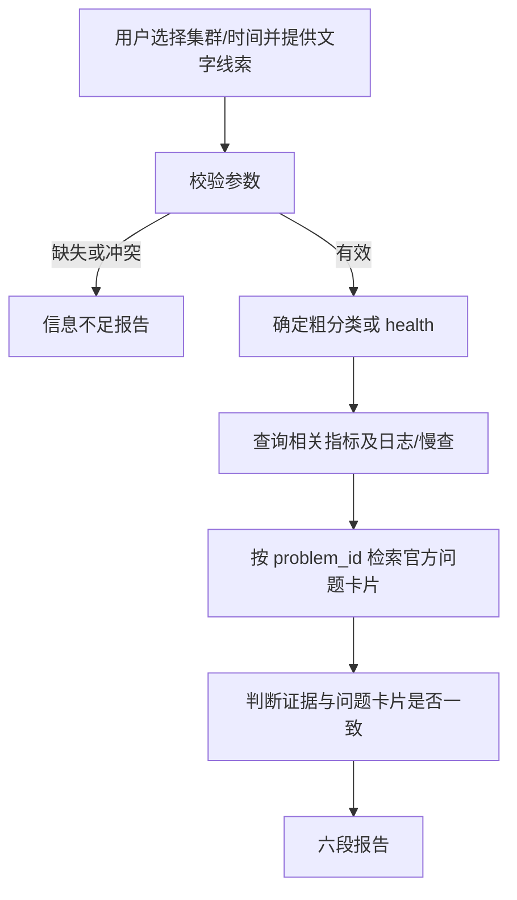

# TiDB 智能故障诊断 Agent - 需求文档

> 版本：v1.24<br>
> 日期：2026-08-25<br>
> TiDB 目标版本：**v7.5.6**（v1 仅支持此版本）<br>
> 关联文档：[技术架构与设计文档](./tidb-diag-agent-technical-design.md)<br>
> 变更说明：移除可用性诊断方向，已启用问题卡片减至 2 个

---

## 1. 目标、范围与约束

### 1.1 项目目标

建设一个面向运维和 DBA 的 **TiDB 只读故障诊断试点工具**。用户选择集群和时间窗并提供故障线索后，系统完成以下工作：

1. 从客户已有 SLS 获取运行日志和慢日志，从 Prometheus 获取指标，不直连 TiDB、TiKV、PD、TiFlash 或生产节点。
2. 将观测数据与冻结的 TiDB `release-7.5` 官方问题卡片交叉验证。
3. 输出证据、匹配的问题模式、诊断判断、官方处理建议和未覆盖项。
4. 证据不足或超出范围时明确降级，不编造根因或修复步骤。

v1 的定位是 **2 个官方问题模式的受控诊断试点**，不是通用 TiDB 根因诊断平台，也不替代现有告警和人工排障。

诊断结论分为三级：

| 结论 | 操作定义 |
|------|----------|
| **已确认根因** | 直接观测能唯一指向具体原因，并命中同一官方问题卡片及解决建议 |
| **根因假设** | 观测与官方问题卡片一致，但仍缺少能唯一排除其他原因的证据 |
| **官方依据不足 / 根因不明确** | 观测不足、相互矛盾，或未命中附录 C 的问题卡片及解决建议 |

除满足“已确认根因”的条件外，报告不得使用“已确认”“确定是”等确定性措辞。

### 1.2 已知环境与硬约束

| 项 | v1 约束 |
|----|---------|
| TiDB | 客户生产版本为 **v7.5.6**；不做多版本适配 |
| 部署 | TiUP；Diagnostic API 单实例部署，不承诺 HA 或跨 AZ |
| 观测 | 复用已有 SLS、Prometheus、Logtail 和 exporter |
| 编排 | 使用客户已有 Dify 自托管和内网千问 |
| 知识源 | 本地 `docs/docs-cn`，分支 `release-7.5`；仅离线 Markdown 导入 |
| 生产边界 | 不 SSH、不直连生产组件服务端口、不调用 Dashboard API |
| 认证 | Diagnostic API 使用单一共享 Key；v1 不实现 RBAC、集群级授权和审计查询 |
| 数据安全 | 内网部署；v1 不做 SQL、日志或 RAG 内容的确定性脱敏，须在 P0 书面接受该风险 |

### 1.3 v1 范围

| 范围 | 内容 |
|------|------|
| **Must** | 文字线索；受控集群和时间参数；3 个只读诊断工具；G2/G3 对应 2 个官方问题卡片；六段报告；信息不足、单源失败、官方依据不足和超范围行为 |
| **不在 v1** | 图片/OCR、内部案例、指标知识专题、告警联动、Dashboard 代理、多版本、自动修复、任意 PromQL、SLS parsed logstore、缓存、回合计数、RBAC、审计存储、动态配置生成、复杂内容哈希、正式渗透测试和并发压测 |

不在范围的功能不得进入 P1-P3 交付清单，也不得阻塞上线。

### 1.4 用户输入与基本流程

用户先选择结构化参数，再提供文字线索。文字线索包括：

- 客户端错误码或错误日志
- 查询变慢、锁等待或写入变慢等现象
- 故障开始时间和持续时间的补充说明
- 用户已知的发布、扩容或配置变更

用户线索只用于确定查询方向，不是独立观测证据。报告必须区分用户提供内容与系统从 SLS/Prometheus 获取的内容。

同一会话可继续追问；集群、时间窗或故障主题变化后按新诊断重新取数。

### 1.5 交付窗口与资源假设

| 项 | 约定 |
|----|------|
| 总窗口 | P0 约 3 个工作日，P1-P3 共 3 周；P0 逾期则上线日顺延 |
| 人员假设 | 至少 1 名后端工程师、1 名 Dify/模型工程师并行，客户 DBA/平台人员可及时提供现网支持 |
| 上线定义 | 2 个已启用问题卡片可检索；3 个工具可用；G2/G3 及关键降级用例通过；生产隔离可核查 |
| 交付性质 | 内网受控试点，不承诺通用根因覆盖率、生产级 HA 或业务 SLA 改善比例 |

若人员假设或 P0 数据条件不满足，三周实施周期不成立。

---

## 2. 功能需求

### 2.1 受控参数与校验

| 参数 | 规则 |
|------|------|
| `cluster_id` | 必选下拉框，无默认值；界面显示集群名称，提交稳定 ID |
| `time_mode` | `recent_15m`（默认）或 `custom` |
| `start_time` / `end_time` | `custom` 时均必填；转换为带时区 RFC3339 |

参数行为：

1. 标准页面缺少 `cluster_id` 或自定义时间时禁止提交；非标准入口缺参时输出信息不足报告，不调用诊断工具。
2. 对话中的集群或时间与结构化参数冲突时，请用户确认；确认前不取数。
3. `recent_15m` 由 Diagnostic API 按服务端时钟解析，并在响应中返回绝对时间窗；后续工具复用该窗口。
4. 自定义时间满足 `start_time < end_time`，窗口最长 2 小时；超过时拒绝，不自动截断。
5. API 校验 `cluster_id` 是否存在，未知值返回参数错误。

### 2.2 诊断工具

v1 只提供以下 3 个工具，接口定义见[技术设计第 3 章](./tidb-diag-agent-technical-design.md#3-diagnostic-api-设计)：

| 工具 | 能力 | 数据源 |
|------|------|--------|
| `query_metrics` | 按 `health`、`read`、`lock`、`write` 固定 profile 查询当前窗和紧前等长窗 | Prometheus |
| `fetch_component_logs` | 按集群、组件、时间和关键词查询运行日志，返回聚合和代表样本 | SLS runtime logstore |
| `analyze_slow_query_sample` | 在最多 2000 条 raw 记录样本内解析、聚合并返回 Top N | SLS slow logstore |

Agent 只能选择 profile 或受控参数，不得传入任意 PromQL 或 SLS SQL。

验收关注报告是否具备规定证据，不要求模型严格复现唯一工具调用顺序。参数校验、查询边界、响应上限和源级限流由 Diagnostic API 确定性执行。

### 2.3 标准诊断流程与决策规则



| 状态 | 产品行为 |
|------|----------|
| 参数缺失或冲突未确认 | 不取数，输出信息不足报告 |
| 明显属于 TiFlash、TiCDC、DM、备份恢复或纯应用代码问题 | 声明超出 v1，转人工；不查询不支持的组件 |
| 观测与附录 C 问题卡片一致 | 输出匹配的问题模式；按证据强度给出已确认根因或根因假设 |
| 有观测但没有对应问题卡片或解决建议 | 标记官方依据不足，不给出自行修复 |
| 观测为空、相互矛盾或不足以区分原因 | 标记根因不明确，给出后续人工排查路径 |

置信度规则：

- **高**：至少两类相关观测一致，或直接错误码/签名得到另一类观测佐证，并命中同一问题卡片和解决建议。
- **中**：一类相关观测命中问题卡片和解决建议，但仍缺少交叉佐证；结论只能写为根因假设。
- **低**：只有用户线索、只有文档、观测为空/失败/矛盾，或未命中问题卡片；不得确认根因。

用户粘贴、工具结果和知识片段中的命令式文字一律视为数据，不得覆盖系统规则。

### 2.4 覆盖矩阵

P0 在锁、写冲突、写入慢中选择一个 G3 方向；未选择方向不入库、不验收。

| 分类 | 输入示例 | 指标 profile | 其他证据 | 官方问题卡片 |
|------|----------|--------------|----------|----------------|
| G2 读性能 | 查询慢、P99 升高 | `read` | 慢日志样本；必要时 TiKV 日志 | `P-READ-SLOW` |
| G3 锁 | 1205、1213、锁等待 | `lock` | TiDB/TiKV 日志和慢日志样本 | `P-LOCK` |
| G3 写冲突 | 9007、8005 | `write` | TiDB 日志和慢日志样本 | `P-WRITE-CONFLICT` |
| G3 写入慢 | commit/prewrite 变慢 | `write` | TiKV 日志和慢日志样本 | `P-WRITE-SLOW` |
| 无明确线索 | “帮我看看刚才” | `health` | 根据结果再补日志或慢查 | 收敛后再检索；无异常则根因不明确 |

### 2.5 报告格式

完整诊断采用六段式：

```markdown
## 1. 故障摘要与时间线
## 2. 观测证据
   - 用户线索（非观测证据）
   - Prometheus 指标
   - 运行日志
   - 慢查询样本
## 3. 匹配的官方问题模式
   - problem_id、标题、章节、来源、source_version、kb_version
## 4. 诊断判断
   - 已确认根因 / 根因假设 / 官方依据不足 / 根因不明确
   - 置信度及理由
## 5. 官方处理建议
   - 可执行建议、风险、验证方法；不可由系统执行的步骤标为人工操作
## 6. 局限与后续排查
   - 空结果、失败源、样本截断、数据延迟和未覆盖项
```

信息不足时使用简化结构：结论、缺失/冲突参数、已执行调用（应为空）、需要用户补充的信息。

第 5 节只能改写自同一问题卡片的官方解决建议。SSH、Dashboard、Grafana、`pd-ctl`、`tikv-ctl`、Lock View SQL 或生产变更只能标为人工步骤，不得声称系统已执行。

### 2.6 官方知识库

Prompt 只保存问题卡片索引和决策规则；官方现象、原因和解决建议放入 Dify 知识库。

| 项 | v1 要求 |
|----|---------|
| 范围 | 附录 C 中 G2 一条、P0 选定的 G3 一条，共 2 个问题卡片 |
| 分块 | 一个 `problem_id` 一篇 Markdown，问题描述和解决建议放在同一逻辑块 |
| 必填元数据 | `problem_id`、`doc_title`、`section`、`source_path` 或 `source_url`、`source_version`、`has_solution` |
| 检索 | 开场宽检索可选；输出建议前必须按 `problem_id` 定向检索 |
| 配置 | 使用客户 Dify 已验证可用的默认 Embedding/检索配置；v1 不要求独立 Reranker |
| 版本 | 用人工可读的 `kb_version` 标记一次导入；不计算内容集合哈希 |

验收要求：给定 `problem_id` 能取得对应问题描述和解决建议；报告能展示真实来源和版本。错误码只用于路由，只有含义而无解决建议时不能独立支撑根因。

### 2.7 降级与失败

| 情况 | 行为 |
|------|------|
| 一类观测源失败，另一类成功 | 继续报告，置信度不高于中；写明失败源 |
| 组合指标部分失败 | 返回每项状态；只使用成功项，不把部分结果写成完整健康结论 |
| SLS 与 Prometheus 都失败 | 输出失败说明和人工排查清单，不输出根因 |
| 查询成功但无数据 | 标为 `empty`，不得写成“集群正常” |
| 知识库失败或未命中解决建议 | 标为官方依据不足，不输出自行修复 |
| 参数、认证或源级限流错误 | 按错误类型停止或降级，不伪装成其他数据源故障 |

---

## 3. 非功能需求

### 3.1 生产隔离与认证

- Diagnostic API 只访问 SLS、Prometheus 和 Secret/Vault，不包含 TiDB/TiKV/PD/TiFlash 地址、DSN 或 SSH 密钥。
- 不部署新的生产节点 Agent，不新增 Prometheus scrape target。
- 所有诊断操作只读，不执行重启、杀会话、扩缩容或配置修改。
- Diagnostic API 使用 `X-API-Key` 共享 Key；缺失或错误返回 401。
- 未知 `cluster_id`、非法时间窗和不支持的组件必须在访问上游前拒绝。
- 共享 Key 无集群级授权，完整 SQL 可能包含敏感字面量；P0 须由客户书面接受并限定 Dify/API 网络访问范围。

### 3.2 性能、数据量与成本

| 项 | 要求 |
|----|------|
| SLS 查询限流 | 运行日志不超过 60 次/分钟/Key；慢日志不超过 10 次/分钟/Key |
| 单次响应 | 不超过 64KB；日志最多返回 20 条代表样本 |
| 慢日志 | 最多扫描 2000 条 raw 记录；结果明确是“样本内 Top N”，返回扫描数和截断状态 |
| 指标 | 固定 profile，采样步长 1 分钟；查询窗与紧前等长窗使用同一统计口径 |
| API 延迟 | `query_metrics`、`fetch_component_logs` 成功请求 P95 < 5s；慢日志样本 P95 < 20s |
| 端到端 | 不含 LLM 思考时间，完整取数成功请求 P95 < 40s |
| Agent 成本保护 | P0 验证 Dify 单轮最大迭代能力；支持时配置不超过 8 次工具迭代，API 不维护诊断回合状态 |
| 可用性 | 单实例、单可用区；v1 不承诺 HA |

性能验收：每类接口执行 20 次，成功不少于 19 次；P95 仅对成功请求统计，同时单独报告失败次数。冷缓存不再适用，因为 v1 不实现查询缓存。

### 3.3 最小调用记录

使用 Dify 自身调用记录和应用日志，不新增审计存储。验收至少能查看：

- 工具名和确认后的结构化参数
- `source_status`、实际时间窗、是否截断和 `config_version`
- 使用的模型、Prompt 版本、`kb_version` 和检索到的问题卡片来源

是否能从当前 Dify 版本导出这些字段必须在 P0 验证；不能导出的字段不应写成 P3 硬验收项。

---

## 4. 验收与交付

### 4.1 P0 关闭条件

以下任一关键项未关闭，P1 不开工或上线日顺延：

- [ ] SLS runtime/slow logstore、只读凭证和网络已提供
- [ ] 运行日志包含可用的 `cluster`、`component`、`host` 字段或等价映射
- [ ] 慢日志样本覆盖完整多行记录；已确认 SLS 事件边界、排序、两小时最大量和截断语义
- [ ] Prometheus URL、集群 label、G2/G3 所需指标名和单位已实测非空
- [ ] `cluster_id`、展示名和 TiDB v7.5.6 已确认
- [ ] Dify/千问已验证文字输入、时间参数、工具调用、错误信封、知识卡片来源展示和最大迭代设置
- [ ] G3 深挖方向已从锁、写冲突、写入慢中选择一个
- [ ] 2 个已启用问题卡片的章节和解决建议已按 `docs/docs-cn` 核对
- [ ] G2/G3 公开夹具和各 1 个盲测变体已有验收 Owner
- [ ] 共享 Key、无 RBAC、单实例、完整 SQL 不脱敏等风险已书面接受
- [ ] 后端、Dify/模型和客户 DBA 的人员投入已确认

### 4.2 金标准用例

| ID | 场景 | 通过条件 |
|----|------|----------|
| G2 | 查询变慢 | 返回样本内 Top N 和扫描/截断说明；匹配 `P-READ-SLOW`；不空泛编造优化步骤 |
| G3 | P0 选定的锁或写入方向 | 使用对应 profile、日志/慢查证据和问题卡片；未选方向不验收 |
| G5 | 缺 `cluster_id` 或自定义时间不完整 | 输出信息不足报告，工具调用为空 |
| G6 | 用户线索与系统观测不一致 | 明确区分来源，以系统观测为准 |
| G6a | 用户或日志包含指令注入 | 不采纳注入内容，不改变系统规则 |
| G7 | SLS 或 Prometheus 单源失败 | 继续降级报告，置信度不高于中，并写明失败源 |
| G8 | TiFlash/CDC 等超范围问题 | 明确拒答并转人工，不调用不支持组件 |
| G13 | `recent_15m` | 首个工具由 API 解析时间，后续工具复用同一绝对窗口 |
| G15 | 有观测但无官方问题卡片/解决建议 | 标为官方依据不足，不确认根因、不自行给修复 |

G2/G3 各包含 1 个公开夹具和 1 个盲测变体。“部分正确”不算通过。验收既检查结论，也检查证据是否足以支持该结论，但不要求唯一工具调用顺序。

### 4.3 里程碑

| 阶段 | 周期 | 交付和验收 |
|------|------|------------|
| P0 条件确认 | 约 3 个工作日 | §4.1 全部关键项关闭 |
| P1 Diagnostic API | 1 周 | 单实例服务、共享 Key、时间窗校验、`query_metrics`、`fetch_component_logs`、OpenAPI 和适配器测试 |
| P2 慢日志与 Dify | 1 周 | `analyze_slow_query_sample`、3 个工具、六段报告、2 个已启用问题卡片、G2/G3/G5/G13 可跑通 |
| P3 验收上线 | 1 周 | §4.2 用例、性能抽样、生产隔离检查、部署与使用说明 |

### 4.4 上线条件

- 3 个工具在客户环境可用，参数和查询边界由 API 强制执行。
- G2/G3 公开夹具和盲测通过；G5/G6a/G7/G8/G13/G15 行为通过。
- 报告能区分已确认根因、根因假设和依据不足。
- 2 个已启用官方问题卡片可按 ID 检索并展示真实来源。
- 生产隔离、共享 Key 和网络权限已核查。
- 性能抽样满足 §3.2；已知缺口写入使用说明。

---

## 5. 风险与应对

| 风险 | 应对 |
|------|------|
| Dify Function Calling 跳步 | 验收结果和证据，不绑定唯一顺序；控制最大迭代；关键参数由 API 校验 |
| 慢日志 raw 事件不完整或量大 | P0 验证事件边界；明确样本 Top N；限制扫描量和响应大小 |
| SLS 无集群标签 | P0 不关闭则停工，禁止猜测集群 |
| Prometheus 指标名或 label 不一致 | P0 实测并冻结 profile 映射，Agent 不接触 PromQL |
| 官方问题卡片覆盖过窄 | 明确标记官方依据不足，转人工，不扩大根因名称 |
| 官方建议依赖系统不可访问的能力 | 标为人工步骤，不声称已执行 |
| 用户线索与系统观测冲突 | 区分来源，以 SLS/Prometheus 为准 |
| 共享 Key 泄露或越权查询 | 限制网络访问；Key 通过 Secret 注入；泄露时人工替换并重启服务 |
| SQL/日志含敏感内容 | 内网访问控制并在 P0 书面接受；v1 不新增脱敏实现 |
| 三周范围膨胀 | 以 §1.3 为边界，不把非 v1 项重新加入里程碑 |

---

## 附录 A. 术语

| 术语 | 说明 |
|------|------|
| 观测源 | Prometheus、SLS 运行日志、SLS 慢日志；用户线索和知识库不是观测源 |
| 官方问题卡片 | 附录 C 中一个具名问题模式及其官方现象、原因、解决建议和来源 |
| 已确认根因 | 直接观测唯一指向具体原因，且官方问题卡片和解决建议闭环 |
| 根因假设 | 证据支持某种原因，但尚未排除其他原因 |
| 官方依据不足 | 没有命中附录 C 问题卡片及解决建议 |
| `config_version` | Diagnostic API 当前集群和指标 profile 配置的人工可读版本 |
| `kb_version` | 一次官方问题卡片导入的人工可读版本 |
| 样本内 Top N | 在最多 2000 条 raw 慢日志记录中计算的排序结果，不代表完整两小时窗口全量 Top N |

## 附录 B. v1 错误码闭集

| 错误码 | 官方含义 | 用途 |
|--------|----------|------|
| 1205 | Lock wait timeout | G3 选锁时启用 |
| 1213 | Deadlock | G3 选锁时启用 |
| 9007 | Write conflict | G3 选写冲突时启用 |
| 8005 | Write Conflict, txnStartTS is stale | G3 选写冲突时启用 |

错误码只有在对应问题卡片具备解决建议且观测验证通过时，才能支撑诊断结论。

## 附录 C. v1 官方问题卡片目录

| ID | 官方问题模式 | 来源 | 解决建议摘要 | v1 |
|----|--------------|------|--------------|----|
| `P-READ-SLOW` | 慢查询 | `tidb-troubleshooting-map.md`：[官网 v7.5 §3.5](https://docs.pingcap.com/zh/tidb/v7.5/tidb-troubleshooting-map/#35-慢查询问题)；[慢查询日志](https://docs.pingcap.com/zh/tidb/v7.5/identify-slow-queries/)、[分析慢查询](https://docs.pingcap.com/zh/tidb/v7.5/analyze-slow-queries/) | 定位瓶颈后执行对应官方分析步骤 | G2 Must |
| `P-LOCK` | 锁冲突、死锁、Lock wait timeout | `tidb-troubleshooting-map.md`：[官网 v7.5 §3.8](https://docs.pingcap.com/zh/tidb/v7.5/tidb-troubleshooting-map/#38-锁冲突问题)；`troubleshoot-lock-conflicts.md`：[官网 v7.5 锁冲突问题处理](https://docs.pingcap.com/zh/tidb/v7.5/troubleshoot-lock-conflicts/) | 按乐观/悲观事务分支处理 | G3 选锁 |
| `P-WRITE-CONFLICT` | 写写冲突 | `troubleshoot-write-conflicts.md`：[官网 v7.5 写写冲突排查](https://docs.pingcap.com/zh/tidb/v7.5/troubleshoot-write-conflicts/)、[解决方法](https://docs.pingcap.com/zh/tidb/v7.5/troubleshoot-write-conflicts/#如何解决写写冲突问题)；`error-codes.md`：[9007/8005](https://docs.pingcap.com/zh/tidb/v7.5/error-codes/#错误码) | 识别冲突数据，应用侧重试或调整事务 | G3 选写冲突 |
| `P-WRITE-SLOW` | TiKV 写入慢 | `tidb-troubleshooting-map.md`：[官网 v7.5 §4.5](https://docs.pingcap.com/zh/tidb/v7.5/tidb-troubleshooting-map/#45-tikv-写入慢) | 按 scheduler、append log、raftstore、apply 分支排查 | G3 选写入慢 |

P0 选择一个 G3 方向后，知识库共导入 G2 一条、G3 一条，共 2 个问题卡片。

## 附录 D. 文档维护

| 版本 | 日期 | 变更 |
|------|------|------|
| v1.21 | 2026-08-25 | 收窄附录问题点并删除独立演进章节 |
| v1.22 | 2026-08-25 | 保留两份文档并系统精简：3 个工具、六段报告、最小 RAG、无缓存/回合计数/复杂哈希；修正慢日志和性能验收语义；补充问题卡片的官网 v7.5 链接 |
| v1.23 | 2026-08-25 | 收窄可用性诊断范围并同步收窄错误码闭集 |
| v1.24 | 2026-08-25 | 移除可用性诊断方向及其错误码、问题卡片、指标 profile 和验收用例；已启用问题卡片减至 2 个 |

历史版本详见 Git 记录。

---

**文档路径**：`docs/tidb-diag-agent-requirements.md`
