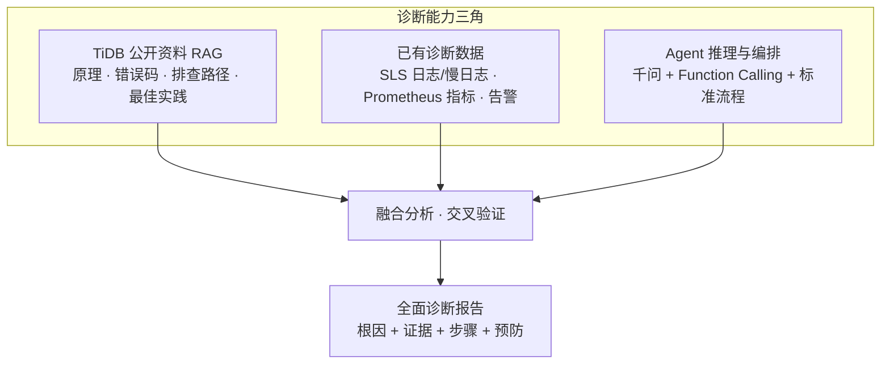
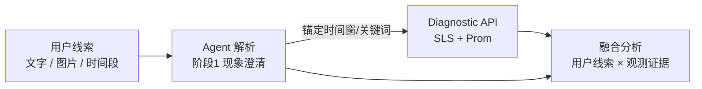
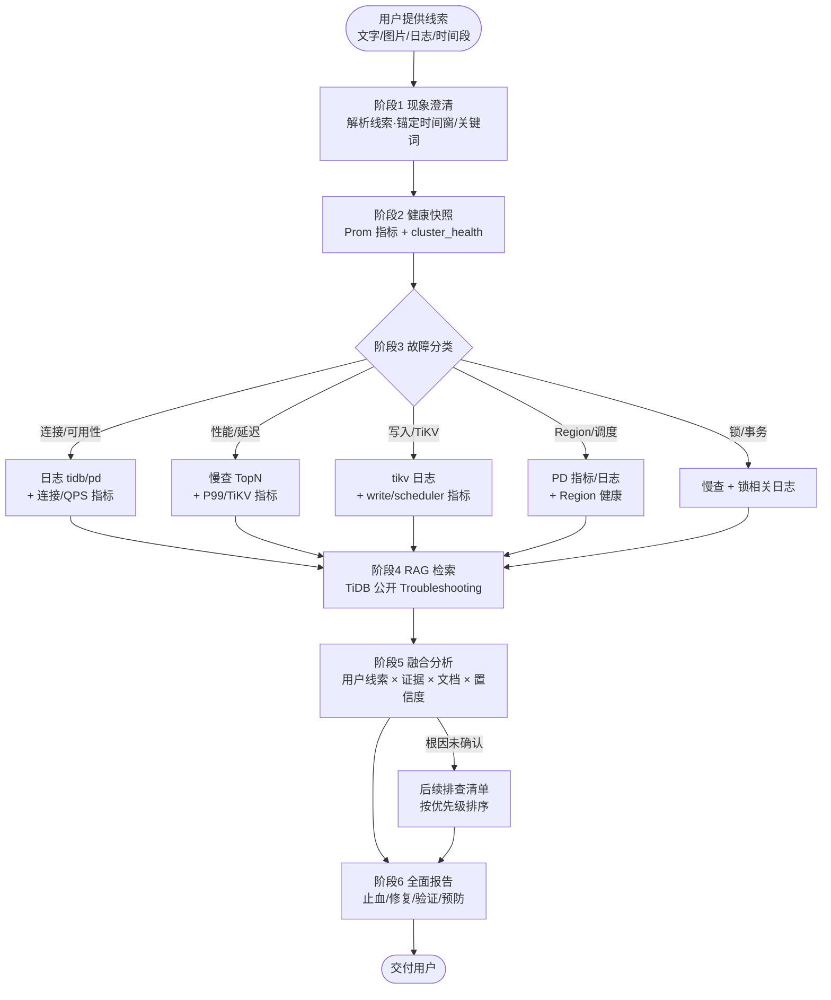

# TiDB 智能故障诊断 Agent — 需求文档

> 版本：v1.7  
> 日期：2026-08-20  
> TiDB 目标版本：**v7.5.6**（当前方案仅支持此单一版本）  
> 关联文档：[技术文档](./tidb-diag-agent-technical-design.md)

---

## 1. 项目概述

### 1.1 目标

建设 **TiDB 智能故障诊断工具**（Agent），在 TiDB 发生故障时：

1. **采集**：从 SLS（日志/慢日志）、Prometheus（指标）等已有观测平台获取诊断数据，不触达 TiDB / TiKV / PD / TiFlash 等主要服务组件；
2. **检索**：基于 **TiDB 官方公开文档与排查手册** 构建 RAG 知识库，为分析提供权威依据；
3. **融合**：将实时/准实时诊断数据与知识库、规则洞察 **交叉验证**，形成完整证据链；
4. **输出**：给出 **全面、结构化、可执行** 的诊断报告（现象归纳、根因分析、证据、修复步骤、预防建议、后续排查路径）。

故障的 **起始线索** 通常由用户在对话中提供（见 §1.5），Agent 据此确定排查方向与时间窗口，再联动 SLS / Prometheus 与知识库完成验证与结论。

### 1.2 核心原则

| 原则 | 说明 |
|------|------|
| **不影响生产的主要服务组件** | Diagnostic API 不 SSH 生产节点、不直连 TiDB / TiKV / PD / TiFlash 等服务端口；只读 SLS / Prometheus 等观测中台 |
| **权威知识支撑** | RAG 库以 **TiDB / PingCAP 公开文档** 为主体，辅以内部手册与历史案例 |
| **多源数据融合** | 指标、运行日志、慢日志、告警、知识库 **联合分析**，结论需多源佐证或明确标注置信度 |
| **标准诊断流程** | 按「现象澄清 → 健康快照 → 分类排查 → 根因定位 → 方案输出 → 预防复盘」固定方法论执行 |
| **复用现有设施** | 日志/慢日志走 **阿里 SLS**；指标走 **Prometheus**；不重复建设采集链路 |
| **平台化交付** | 对话与编排使用 **Dify 自托管 Agent**；内网 **千问模型** 负责推理与报告生成 |
| **安全可审计** | API Key + RBAC + 全链路审计 + 数据脱敏 |
| **渐进式增强** | 慢日志先 API 解析，后续 SLS 加工结构化；知识库 **离线 Markdown 导入**，每季度 **人工复核** 文档内容（版本固定 v7.5.6） |

### 1.3 诊断能力三角

诊断质量依赖三类输入的协同，缺一不可：



| 输入 | 作用 | 缺失时的风险 |
|------|------|--------------|
| TiDB 公开资料 RAG | 提供权威排查路径、参数含义、错误码解释 | 建议空泛、不符合 TiDB 机制 |
| 已有诊断数据 | 提供故障时间线的真实证据 | 结论无法落地、无法定位根因 |
| Agent 编排 | 按场景选工具、组织报告、控制推理边界 | 数据堆砌、无结论 |

### 1.4 不在范围内（v1）

- 自动执行修复操作（重启、缩容、杀会话、改配置）
- 替代现有告警系统
- 新建日志采集链路（复用客户已有 SLS）
- **多 TiDB 版本并存**（当前仅支持 **v7.5.6**；其他版本纳入 v2+ 规划）
- **Dify 知识库联网同步**（v1 仅支持 **离线 Markdown 导入**；URL 抓取、定时同步、在线数据源连接器纳入 v2+）

### 1.5 用户提供的故障线索

故障诊断往往 **始于用户侧信息**，而非 Agent 主动发现。运维/DBA 在 Dify 对话中可通过 **文字或图片** 提供故障来源线索，Agent 在阶段 1（现象澄清）优先解析这些内容，再决定工具调用的时间范围、关键词与排查路径。

| 线索类型 | 典型形式 | 示例 | Agent 如何使用 |
|----------|----------|------|----------------|
| **错误日志（文本）** | 粘贴 ERROR 行、应用报错栈、客户端报错 | `ERROR 9005 Region is unavailable` | 提取错误码、组件、关键词 → 驱动日志查询；作为 RAG 检索词 |
| **错误日志（图片）** | 终端截图、告警卡片、IM 转发截图 | 监控平台红色告警图、sql 客户端报错截图 | 多模态理解/OCR 提取错误码与时间 → **辅助定方向**；仍须 SLS/Prom 拉数验证 |
| **延迟/异常时间段** | 自然语言描述起止时间 | 「14:30–14:45 订单库 P99 从 200ms 升到 3s」 | 确定 Prom/SLS 查询的 `start_time` / `end_time`；与指标曲线对齐 |
| **现象描述** | 业务影响、组件猜测 | 「连接池打满」「写入变慢」「某库查询超时」 | 故障分类（§3.3）→ 选工具组合与 RAG 方向 |
| **变更/发布信息** | 运维操作说明 | 「13:00 TiUP 扩容」「刚发版」 | 对照变更前后指标；优先排查变更相关路径 |

**与观测数据的关系**：



- **用户线索 = 诊断入口与锚点**：决定「查哪段时间、搜什么关键词、走哪条排查路径」。
- **SLS / Prometheus = 可验证证据**：用于确认、补充或反驳用户描述；不能仅凭用户粘贴的一行日志下结论。
- **报告中须区分来源**：证据链中分别列出「用户提供线索」与「SLS/Prom 拉取结果」；二者不一致时说明差异及可能原因（采集延迟、应用层包装、截图不完整等）。
- **图片输入**：依赖 Dify 文件上传与千问 **多模态/视觉** 能力；若当前模型不支持识图，Prompt 应引导用户 **补充文字** 或 **粘贴日志原文**。

---

## 2. 背景与约束

### 2.1 客户环境

| 项 | 现状 |
|----|------|
| **TiDB 版本** | **v7.5.6**（当前方案唯一支持版本） |
| TiDB 部署 | TiUP |
| 观测 | 已有 TiDB Dashboard、Prometheus |
| 日志 | 阿里 SLS 已采集运行日志与慢日志（慢日志暂未解析） |
| AI 平台 | Dify 自托管 |
| 大模型 | 内网千问（Qwen3.5-122B 主推理；Embedding/Rerank 用于知识库） |
| 安全 | 有合规要求，操作需可追溯，敏感数据需脱敏 |

### 2.2 TiDB 版本范围（v1）

| 项 | 说明 |
|----|------|
| 客户生产版本 | **v7.5.6** |
| 方案支持范围 | **仅 v7.5.6**，不做多版本适配 |
| RAG 文档版本 | 使用 PingCAP **v7.5** 文档线（`docs.pingcap.com/tidb/v7.5/...`），与 v7.5.6 补丁版一致 |
| Release Note | 对齐 `v7.5.6` tag（GitHub Release） |
| Prompt / 配置 | 固定写入 `tidb_version: v7.5.6`，无需运行时版本选择 |
| 后续扩展 | 客户升级 TiDB 大版本时，另起版本迭代更新 RAG 文档与 Prompt（v2+） |

### 2.3 模型与平台约束

| 用途 | 模型 / 约束 |
|------|-------------|
| Agent 主推理 | Qwen3.5-122B-A10B-FP8（temperature=0.3, top_p=0.8） |
| 知识库 Embedding | Qwen3-Embedding-4B |
| 知识库 Rerank | Qwen3-Reranker-4B |
| Agent 模式 | Function Calling（优先）；不支持时降级 ReAct |
| Dify 知识库导入 | **仅支持离线 Markdown 文件导入**；不支持 URL 抓取、定时同步、在线数据源连接器 |
| 知识库更新 | 人工离线准备 Markdown → Dify **重新导入 / 覆盖**；建议每季度复核 |

---

## 3. 功能需求

### 3.1 用户交互

| 需求项 | 描述 |
|--------|------|
| 对话入口 | Dify Agent 应用（Chat 模式），支持 **文字 + 文件/图片上传** |
| 输入解析 | Agent 在调用 Diagnostic API **之前**，须从用户输入提取：故障起止时间、集群/库/业务范围、错误码或关键词、是否变更 |
| 追问机制 | 若时间或集群不明确，向用户追问 1–2 个关键问题 |
| 输出形式 | 结构化九段式诊断报告（见 §3.4） |

### 3.2 诊断工具能力

Agent 须能调用以下 Diagnostic API 工具（详见[技术文档 §4.2](./tidb-diag-agent-technical-design.md#42-diagnostic-api-层)）：

| 工具名 | 功能 | 数据源 |
|--------|------|--------|
| `fetch_component_logs` | 按集群/组件/时间/关键词查运行日志 | SLS runtime logstore |
| `analyze_slow_query` | 慢查询 Top N、聚合分析 | SLS slow logstore（raw/parsed） |
| `query_prometheus` | PromQL 查指标 | Prometheus |
| `get_cluster_health` | 集群健康摘要 | Prometheus 为主 |
| `get_recent_alerts` | 近期告警（可选） | Alertmanager |

### 3.3 标准诊断流程（SOP）

Agent 必须按以下顺序执行，可跳过无数据步骤但须说明原因：



**各阶段要求**：

| 阶段 | 要求 |
|------|------|
| 阶段 1：现象澄清 | 解析用户线索；提取错误码、关键词、组件、建议查询时间窗口；用户线索仅作排查锚点，结论须用 SLS/Prom 验证或标注「待验证」 |
| 阶段 2：健康快照 | 调用 `get_cluster_health` + `query_prometheus`（QPS、P99、连接数、TiKV/PD 关键指标）；判断整体可用性、资源瓶颈、指标异常时间点是否与故障吻合 |
| 阶段 3：分类排查 | 按故障类型选择工具组合（见 §3.3.1） |
| 阶段 4：RAG 检索 | 主动检索知识库，按错误码/组件/现象检索官方 Troubleshooting |
| 阶段 5：融合分析 | 交叉对照用户线索、观测数据与知识库；每条根因假设标注支持证据 / 反对证据 / 置信度 |
| 阶段 6：全面建议 | 紧急止血 → 根因修复 → 验证步骤 → 预防复盘；无法确认根因时给出优先级排序的「下一步排查清单」 |

#### 3.3.1 故障分类与排查映射

| 故障分类 | 典型现象 | 必调工具 | 必查 Prom 指标 | RAG 检索关键词 |
|----------|----------|----------|----------------|----------------|
| 可用性 | 连接失败、超时、9005 | logs(tidb,pd), health | connections, QPS, region_health | connection timeout, Region unavailable |
| 读性能 | 查询慢、P99 升高 | slow_query, tidb_p99 | handle_query_duration, coprocessor | slow query, index, coprocessor |
| 写性能 | 写入慢、commit 慢 | slow_query, logs(tikv) | write_duration, raft, latch | tikv write, raft, disk io |
| 资源 | CPU/磁盘/内存高 | health, 资源类 metric | node_cpu, disk_io, memory | resource, oom, disk full |
| 调度 | Region 异常、Leader 缺失 | logs(pd), health | region_health, pending_peer | region, leader, scheduler |
| 锁与事务 | 锁等待、deadlock | slow_query, logs(tidb,tikv) | lock_wait, transaction | lock, deadlock, large transaction |
| 变更引发 | 发布后故障 | logs(全组件), health | 变更前后指标对比 | upgrade, deploy, config change |

### 3.4 多源数据融合规则

| 证据类型 | 来源 | 在报告中的作用 |
|----------|------|----------------|
| **用户故障线索** | 用户对话（文字/图片/粘贴日志/时间段描述） | 锚定排查方向、时间窗口、关键词；须在后续 SLS/Prom 中验证 |
| 指标趋势 | Prometheus | 确认异常时间点、量化影响、排除/确认资源瓶颈 |
| 运行日志 | SLS runtime | 定位 error/panic/超时、错误码、组件 |
| 慢查询 | SLS slow | 定位 Top SQL、索引/扫描/Cop 问题 |
| 告警（可选） | Alertmanager | 与故障时间对齐，补充已知规则命中项 |
| 规则 insights | Diagnostic API 摘要 | API 预生成的统计结论（如「Top1 SQL 占 45%」） |
| 知识库 | TiDB 公开 RAG | 提供官方排查路径、修复步骤、参数建议 |

**融合原则**：

1. **时间对齐**：用户描述的异常时间段、指标异常、日志 ERROR、慢查峰值须在同一时间窗口内对照。
2. **组件闭环**：TiDB 延迟升高 → 同时看 TiDB 连接 + TiKV Cop/Write + PD 调度，避免单组件结论。
3. **文档校验**：修复建议须与 RAG 检索到的官方步骤一致；若观测与文档矛盾，报告中说明。
4. **置信度标注**：高（≥2 类证据一致）、中（单类强证据 + 文档吻合）、低（仅推测）→ 低置信度必须给出验证步骤。

### 3.5 诊断报告格式

Agent 输出须采用以下九段式结构：

```markdown
## 1. 故障摘要
## 2. 现象与时间线
## 3. 健康快照（指标摘要）
## 4. 证据链
   - 4.0 用户提供的故障线索（原文/截图摘要、时间段）
   - 4.1 监控指标（含时间范围）
   - 4.2 运行日志（含组件与条数）
   - 4.3 慢查询（如有）
   - 4.4 知识库依据（引用主题/章节）
## 5. 根因分析（含置信度）
## 6. 修复建议
   - 6.1 紧急处理（低风险优先）
   - 6.2 根因修复
   - 6.3 验证方法
## 7. 预防与优化建议
## 8. 后续排查路径（若根因未确认）
## 9. 数据时效与局限性说明
```

**行为约束**：

- 不臆测；结论需有多源证据或明确标注「待验证」
- 涉及重启、缩容、杀会话、改配置等操作：仅建议，标注风险，不声称已执行
- 优先引用 TiDB 官方排查路径；与观测数据不一致时说明差异
- 数据可能有 1–3 分钟延迟，报告中需注明数据时间范围

**交付前检查清单**：

- [ ] **用户线索**：是否记录用户提供的错误日志/截图/时间段，并说明如何用于锚定排查
- [ ] **故障摘要**：一句话说明影响
- [ ] **时间线**：故障起止、指标/日志异常时间点
- [ ] **健康快照**：关键指标当前值与趋势
- [ ] **分类路径**：说明按哪类故障排查及原因
- [ ] **证据链**：用户线索 + 指标 + 日志 + 慢查 + 知识库，分项列出并区分来源
- [ ] **根因分析**：含置信度与反证说明
- [ ] **修复建议**：紧急止血 → 根因修复 → 验证步骤（分优先级与风险）
- [ ] **预防建议**：监控、索引、配置、容量等
- [ ] **后续排查**：根因未确认时的 Next Steps
- [ ] **数据时效**：SLS/Prom 延迟与查询时间范围

### 3.6 知识库（RAG）需求

#### 3.6.1 知识库定位

| 层级 | 内容 | 来源 |
|------|------|------|
| **L1 官方公开文档（主体）** | Troubleshooting、FAQ、错误码、监控指标说明 | TiDB / PingCAP 公开站点 |
| **L2 版本与组件专题** | v7.5.6 Release Note、TiKV/PD/TiFlash 专题 | 官方文档 + GitHub Release v7.5.6 |
| **L3 内部补充（可选）** | 客户运维手册、历史故障案例、内部基线 | 客户提供 |
| **L4 指标释义（辅助）** | Grafana Dashboard 指标说明、PromQL 与 TiDB 组件映射 | 官方监控文档 + 内部整理 |

> **原则**：L1 占比 ≥ 70%，确保建议与 TiDB 官方排查思路一致；L3 用于补充客户环境差异。

#### 3.6.2 必覆盖文档主题（v7.5.6）

| 分类 | 文档主题 | 诊断用途 |
|------|----------|----------|
| 故障排查 | TiDB 集群故障排查总览 | 集群级排查总入口 |
| 集群诊断 | TiDB Dashboard 简介 | Dashboard 诊断能力 |
| 集群诊断 | Statement Summary 表 | 慢 SQL、集群负载 |
| 错误码 | TiDB 错误码参考 | 日志/error 快速映射 |
| 性能 | 识别慢查询 | 慢查分析 |
| 性能 | SQL 性能优化 | SQL/索引优化建议 |
| TiKV | TiKV 故障排查 | TiKV 延迟/写入问题 |
| PD | PD 故障排查 | Region/调度类故障 |
| 事务与锁 | 锁冲突与锁管理 | 锁等待、事务超时 |
| 运维 | TiUP 概述 / 集群部署与管理 | 扩缩容、升级相关故障 |
| 监控 | TiDB / TiKV 监控指标 | 指标解读与 Prom 对照 |
| 配置 | TiDB / TiKV / PD 配置项 | 配置相关故障 |
| 版本说明 | TiDB v7.5.6 Release | 已知问题与变更 |

完整 URL 清单见[技术文档 §4.1.4.2](./tidb-diag-agent-technical-design.md#4142-建议入库的-tidb-公开资料清单)。

#### 3.6.3 检索策略

Agent 在每个诊断阶段应 **主动检索** 知识库：

| 诊断阶段 | 检索 Query 示例 | 目的 |
|----------|-----------------|------|
| 现象澄清 | 「TiDB 连接超时 常见原因」 | 缩小排查方向 |
| 见错误码 | 「TiDB error 9005 Region is unavailable」 | 错误码 → 排查路径 |
| 性能问题 | 「慢查询 Cop_time 高 TiKV 扫描」 | SQL/索引优化建议 |
| 见 TiKV 指标异常 | 「tikv scheduler latch wait 高」 | 组件级排查 |
| 输出建议前 | 「{根因假设} TiDB 官方 修复步骤」 | 验证建议与官方一致 |

#### 3.6.4 知识库质量验收

- [ ] 全部内容经 **离线 Markdown 批量导入** Dify，无 URL / 定时同步依赖
- [ ] 覆盖 Top 20 常见 TiDB 错误码及官方说明
- [ ] 覆盖连接/性能/TiKV/PD/锁 五类场景的 Troubleshooting 章节
- [ ] 给定错误码或现象，Rerank 后 Top-3 命中相关文档
- [ ] Agent 报告「知识库依据」章节 **逐条列出文档标题/章节**

---

## 4. 非功能需求

### 4.1 生产隔离

| 层级 | 要求 |
|------|------|
| 网络 | Diagnostic API / Dify 与 TiDB / TiKV / PD / TiFlash 等服务端口隔离；无 4000/2379/20180 SSH 访问 |
| 日志 | 只读 SLS API；不 SSH grep 生产日志文件 |
| 慢查 | 只读 SLS；不直连生产 `cluster_slow_query`（除非客户后续明确允许 RO） |
| 指标 | 只读 Prometheus；不新增 scrape target |
| 采集 | 复用已有 Logtail，诊断系统不部署新 Agent 到生产 |
| 操作 | v1 只读诊断，不执行任何写操作 |

### 4.2 性能与限流

| 项 | 要求 |
|----|------|
| SLS 查询 | ≤60 次/分钟/Key |
| 慢查查询 | ≤10 次/分钟/Key |
| 单次响应 | ≤512KB；日志 ≤500 行；慢查 raw 拉取 ≤2000 条 |
| 缓存 | 相同查询 5 分钟内返回缓存 |
| API 延迟 | 单集群并发 5 对话，API P95 < 5s（不含 LLM） |
| 日志查询 | 指定集群/时间/关键词，30s 内返回 SLS 日志摘要 |
| 慢查分析 | 1h 内 Top 10 慢 SQL，含 digest/耗时/库名 |

### 4.3 安全与审计

| 项 | 要求 |
|----|------|
| 认证 | HTTPS + API Key |
| 授权 | RBAC（viewer / operator / admin / auditor） |
| 集群隔离 | API Key 绑定 `allowed_clusters` |
| 审计 | 全量 API 请求记录；保留 ≥180 天；与 Dify 对话通过 `request_id` / `conversation_id` 关联 |
| 脱敏 | 返回 LLM 前正则脱敏：密码、Token、DSN、手机号、身份证等 |
| 凭证管理 | SLS AK/SK 存 Vault，**不进入 Dify** |

---

## 5. 典型使用场景

### 5.1 场景：连接超时

**用户输入**：「14:30 起应用报 TiDB 连接超时」

**期望行为**：

1. Agent 锚定时间窗口（约 14:25–14:35），调用 `get_cluster_health` 获取连接数/QPS/TiKV lag
2. 调用 `fetch_component_logs(tidb, timeout)` 查 ERROR 日志
3. 检索知识库「连接超时」「9005」
4. 融合指标 + 日志 + 文档，标注置信度
5. 输出九段式报告（证据链 + 修复 + 验证 + 预防）

### 5.2 场景：查询变慢

**用户输入**：「订单库查询变慢」

**期望行为**：

1. 检索知识库「慢查询优化」「Cop_time 高」
2. 调用 `query_prometheus(tidb_p99)` 获取 P99 趋势
3. 调用 `analyze_slow_query(db=orders, 1h)` 获取 Top 慢 SQL
4. 必要时调用 `fetch_component_logs(tikv, slow)` 进一步佐证
5. 输出全面报告（Top SQL + 索引建议 + 官方优化步骤 + 验证方法）

---

## 6. 交付阶段与里程碑

| 阶段 | 周期 | 交付物 | 生产影响 |
|------|------|--------|----------|
| P0 需求确认 | 3 天 | SLS logstore 清单、Prom 指标 label、集群映射表 | 无 |
| P1 Diagnostic API 骨架 | 1 周 | 认证/审计/限流 + Prom 查询 + SLS 运行日志 | 无 |
| P2 慢查 + Dify 联调 | 1 周 | SLS 慢查（raw 解析）+ Dify Agent + 3 工具 | 无 |
| P3 知识库 + Prompt | 1 周 | RAG 离线 MD 导入 + Prompt 调优 + 2 场景演示 | 无 |
| P4 SLS 慢查加工 | 1 周 | SLS parsed logstore + API 切换 | 无（仅 SLS 侧加工） |
| P5 安全评审与上线 | 3 天 | 渗透测试、审计验证、运维手册 | 无 |

**合计：约 4–5 周**

### 6.1 P0 — 需求确认（输入清单）

需客户提供的材料：

- [ ] SLS Project 名称、logstore 名称（runtime / slow）
- [ ] SLS 日志样例（运行日志、慢日志各 2 条，可打码）
- [ ] SLS 字段说明（是否有 cluster/component 标签）
- [ ] Prometheus URL、集群 label 命名（如 `cluster=prod-01`）
- [x] **TiDB 版本**：**v7.5.6**（已确认，RAG 与 Prompt 固定此版本）
- [ ] 客户 TiUP 版本（用于 TiUP 文档链接确认，默认 v1.14）
- [ ] Dify 访问地址、千问 API 接入方式
- [ ] 安全要求文档（审计留存、网络隔离）

### 6.2 各阶段验收要点

| 阶段 | 验收标准 |
|------|----------|
| P1 | 给定时间范围，可从 SLS 返回 tidb ERROR 日志；可从 Prom 返回 QPS、P99 曲线摘要；未授权请求返回 401；审计日志可查 |
| P2 | 场景 1（连接超时）和场景 2（查询变慢）Agent 可拉数据并输出报告 |
| P3 | Top 20 错误码检索 Top-3 命中；五类场景 Troubleshooting 均可检索；3 个历史故障回放报告符合 §3.5 检查清单 |
| P4 | 慢查 Top 10 查询 P95 延迟 < 3s；不再依赖大 volume raw 拉取 |
| P5 | 安全测试通过；运维手册与用户手册交付 |

---

## 7. 验收标准（总）

| # | 验收项 | 标准 |
|---|--------|------|
| 1 | 主要服务组件隔离 | Diagnostic API 无 TiDB/TiKV/PD/TiFlash 直连、无 SSH 生产节点 |
| 2 | 日志查询 | 指定集群/时间/关键词，30s 内返回 SLS 日志摘要 |
| 3 | 慢查分析 | 1h 内 Top 10 慢 SQL，含 digest/耗时/库名 |
| 4 | 指标查询 | 返回 P99/QPS 等指标及趋势摘要 |
| 5 | Agent 全面报告 | 符合 §3.5 九段式结构：含用户线索、证据链、知识库依据、置信度、修复/验证/预防 |
| 6 | RAG 知识库 | Top 20 错误码 + 五类 Troubleshooting 可检索；**离线 MD 导入**；报告含知识库依据 |
| 7 | 安全 | API Key 鉴权、越权拒绝、审计可追溯 |
| 8 | 脱敏 | 日志/SQL 中无明文密码/Token |
| 9 | 稳定性 | 单集群并发 5 对话，API P95 < 5s（不含 LLM） |

---

## 8. 风险与应对

| 风险 | 影响 | 应对 |
|------|------|------|
| 用户线索与 SLS 不一致 | 误判根因或漏查 | 报告中区分来源；以 SLS/Prom 为准验证；说明采集延迟或应用层包装差异 |
| SLS 慢日志未解析，量大时 API 慢 | 慢查工具超时 | P2 raw 解析 + P4 SLS 加工；限流 + 缓存 |
| SLS 无 cluster 标签 | 多集群查询不准 | P0 确认字段；必要时 SLS 加工补 tag |
| Prom label 与集群映射不一致 | 指标查错集群 | P0 建立 cluster 映射表；API 层校验 |
| 千问 FC 不稳定 | 工具调用失败 | ReAct 降级 + Prompt 约束；Workflow 固定采集 |
| SLS 查询费用 | 成本上升 | 限流、缓存、索引优化 |
| 日志延迟 1–3 分钟 | 报告时效 | Prompt 注明；结合 Prom 实时性更高的指标 |
| 知识库仅离线导入、无自动同步 | 文档更新滞后 | 按清单季度 **人工复核 + 重新导入** Dify；v2+ 评估外部 ETL 流水线 |
| RAG 文档与 v7.5.6 不一致 | 建议偏离生产实际 | v1 固定 v7.5 文档线 + v7.5.6 Release；季度复核 |
| 仅依赖模型未查 RAG | 建议空泛、不符合官方 | Prompt 强制阶段 4 检索；报告须含「知识库依据」章节 |
| 观测数据与文档矛盾 | 结论冲突 | 融合规则要求报告中说明差异并给出验证步骤 |

---

## 9. 后续演进（v2+）

- 接入 Alertmanager，告警触发自动预采集
- 对接 TiDB Dashboard API（只读代理）补充拓扑
- 对接飞书/钉钉，故障报告推送
- 故障案例自动沉淀回知识库（L3 内部案例层）
- 规则引擎 + LLM 混合：已知故障模板直出，复杂场景再调模型
- TiDB 公开文档 **外部 ETL + 批量导入 Dify** 流水线
- 多 TiDB 版本支持

---

## 10. 待客户确认项

- [ ] SLS Project / logstore 正式名称
- [ ] 慢日志样本格式（JSON / 多行文本）
- [ ] Prometheus 集群 label 规范
- [ ] TiUP 版本（TiUP 文档链接对齐，默认 v1.14）
- [ ] 审计日志保留天数（默认 180 天）
- [ ] Diagnostic API 部署环境（VM / K8s）

> **已确认**：TiDB 版本 **v7.5.6**，当前方案不做多版本适配。

---

## 附录 A. 术语

| 术语 | 说明 |
|------|------|
| SLS | 阿里云日志服务（Simple Log Service） |
| Diagnostic API | TiDB 诊断中间层 REST 服务 |
| Function Calling | 模型原生工具调用能力 |
| RAG | Retrieval-Augmented Generation，检索增强生成 |
| L1/L3 知识层 | L1=TiDB 公开文档（主体）；L3=内部案例/手册（补充） |
| 用户故障线索 | 用户在对话中提供的错误日志、截图、异常时间段、现象描述等，用于锚定排查方向 |
| 离线 MD 导入 | Dify 知识库 v1 唯一入库方式：外部准备 Markdown 后手动上传，不支持联网同步 |

---

**文档路径**：`docs/tidb-diag-agent-requirements.md`
