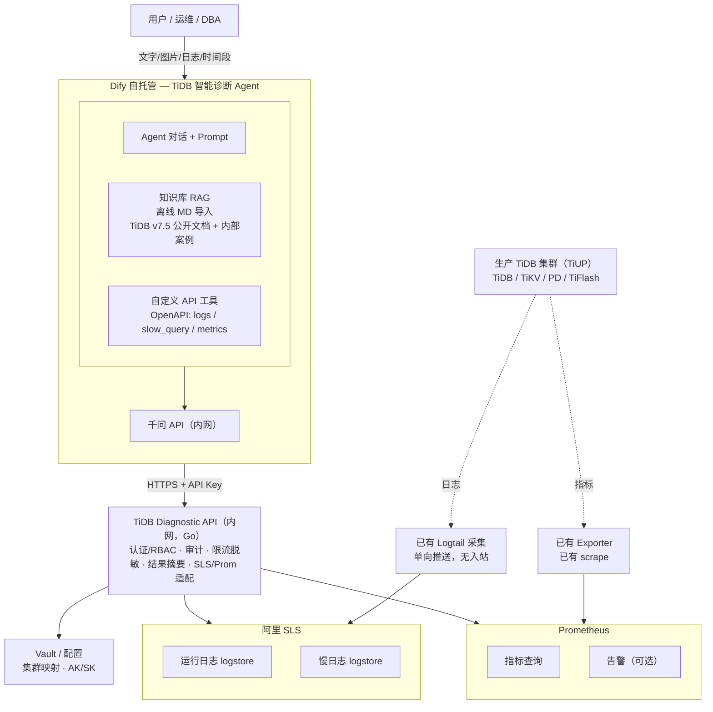
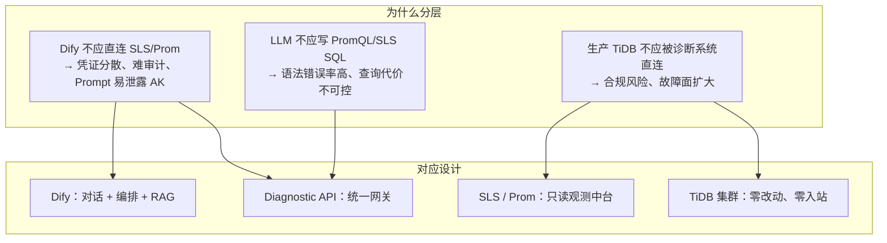
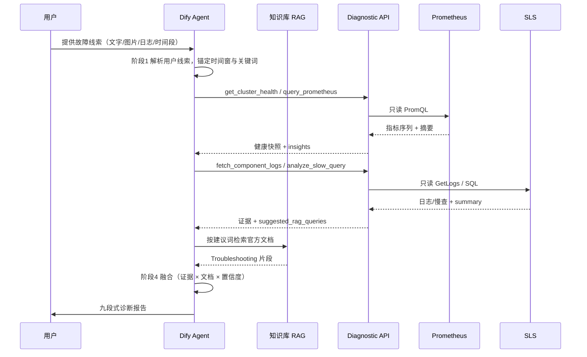
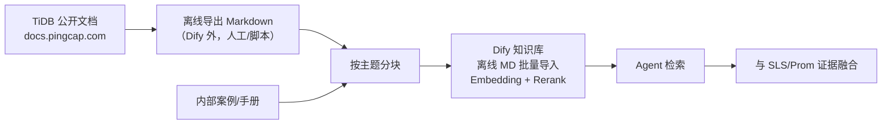
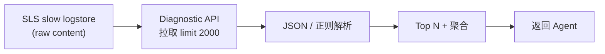
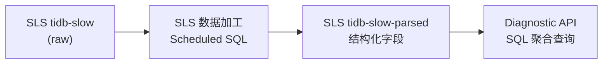
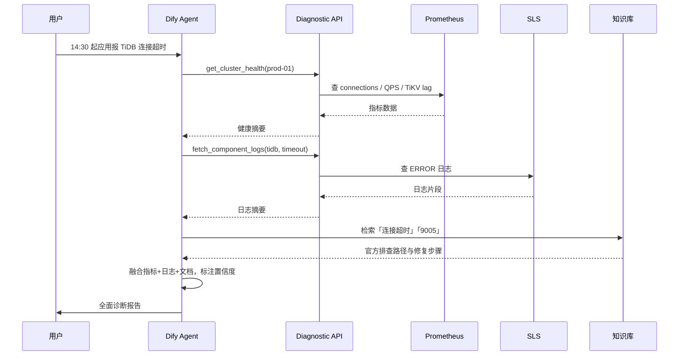
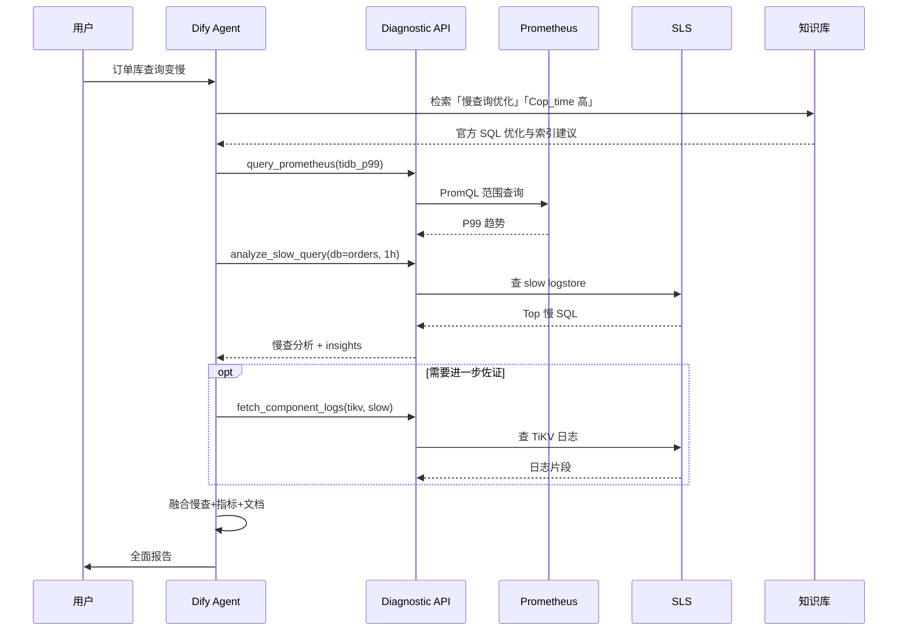
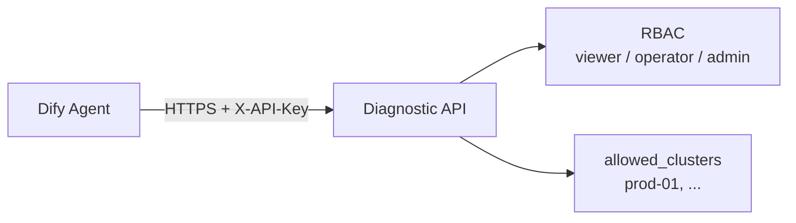
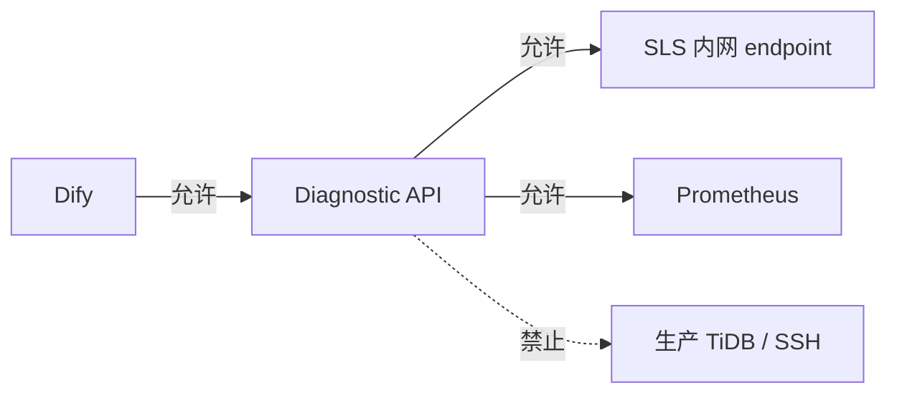

# TiDB 智能故障诊断 Agent — 技术文档

> 版本：v1.7  
> 日期：2026-08-20  
> 方案选型：Dify Agent + Diagnostic API + 阿里 SLS + Prometheus  
> TiDB 目标版本：**v7.5.6**  
> 关联文档：[需求文档](./tidb-diag-agent-requirements.md)

---

## 1. 总体架构



**分层说明**：

| 层级 | 组件 | 说明 |
|------|------|------|
| 用户层 | 运维 / DBA | 提供故障线索（文字、错误日志、截图、异常时间段等），接收诊断报告 |
| 编排层 | Dify Agent + 千问 + 知识库 | 标准诊断流程、工具调度、RAG 检索、报告生成 |
| 服务层 | TiDB Diagnostic API | 认证、审计、脱敏、适配 SLS/Prom |
| 数据层 | SLS / Prometheus / Vault | 日志、慢日志、指标、密钥配置 |
| 采集层 | Logtail / Exporter | 已有单向采集，诊断系统无入站 |
| 生产层 | TiDB 集群（TiUP） | 主要服务组件不被 Diagnostic API 直连 |

### 1.1 架构要点

1. **Dify 不直连 SLS/Prometheus/生产主要服务组件**，只调用 Diagnostic API。
2. **Diagnostic API 只读观测中台**，只读查询 SLS 与 Prometheus。
3. **生产主要服务组件零改动**（复用已有 SLS 采集与 Prom scrape，不新增对 TiDB/TiKV/PD/TiFlash 的访问）。
4. **慢日志**：短期 API 解析 SLS 原始行；中期 SLS 加工出结构化 logstore。
5. **RAG 以 TiDB v7.5 公开资料为主**（对应生产 **v7.5.6**）：官方 Troubleshooting、错误码、监控说明等 **离线 Markdown 导入**。
6. **融合分析**：Agent 必须将 SLS/Prom 返回的 **实时证据** 与 RAG 检索的 **排查路径** 结合，输出带置信度与引用来源的报告。

### 1.2 设计思路

#### 1.2.1 问题拆解：三类输入、一条输出

| 输入类型 | 回答的问题 | 若缺失 |
|----------|------------|--------|
| **用户故障线索** | 「用户看到了什么？何时开始？报什么错？」 | 无法锚定时间窗与关键词，工具查询盲目、报告易偏题 |
| **观测数据**（SLS + Prometheus） | 「这次故障到底发生了什么？」 | 结论无法落地，只剩猜测 |
| **权威知识**（TiDB 公开文档 RAG） | 「官方建议怎么排查、怎么修？」 | 建议空泛，不符合 TiDB 机制 |
| **推理编排**（Agent + 标准流程） | 「如何把数据和文档组织成报告？」 | 数据堆砌，没有结论 |

#### 1.2.2 分层解耦



**核心原则：把「会变化的」和「必须稳定的」分开。**

- **会变化的**：Prompt 调优、工具组合、报告模板、知识库内容 → 放在 **Dify**，迭代成本低。
- **必须稳定的**：鉴权、审计、限流、脱敏、集群映射、查询边界 → 放在 **Diagnostic API**，统一管控。
- **已有且成熟的**：日志采集、指标 scrape → **复用** SLS / Prometheus，不重复建设。

#### 1.2.3 选型逻辑

| 选型 | 替代方案（未采用） | 选择理由 |
|------|-------------------|----------|
| **Dify Agent** | 自研 Chat UI + 编排引擎 | 客户已有 Dify 自托管；Agent / Tool / RAG 一体化，交付快 |
| **Diagnostic API（Go）** | Dify 直连 SLS/Prom | 统一安全边界；封装 PromQL/SLS 复杂度；返回摘要降低 Token 消耗 |
| **阿里 SLS** | 自建 ELK / 直连节点 grep | 客户已有 Logtail 采集；诊断系统只读 API，不触达生产 |
| **Prometheus** | 直连 TiDB Dashboard / TiDB 端口 | 复用已有 scrape；指标趋势是故障时间线对齐的关键证据 |
| **离线 MD 知识库** | 联网同步官方文档 | Dify 平台约束；内网环境；v1 控制范围与版本（v7.5.6） |
| **千问（内网）** | 公有云 API | 满足合规；Function Calling 支持工具调用 |

#### 1.2.4 渐进式交付

1. **P1–P2**：Diagnostic API + Dify 联调 → 先跑通「日志 + 指标 + 慢查 + 对话」主链路。
2. **P3**：知识库 + 标准诊断流程 → 从「能查数据」升级到「能出全面报告」。
3. **P4**：SLS 慢查结构化 → 解决 raw 解析性能瓶颈，**仍不触达生产 TiDB**。
4. **v2+**：告警联动、Dashboard 代理、文档 ETL 等 → 在 v1 稳定后再扩展。

### 1.3 各模块职责与设计缘由

| 模块 | 作用 | 为什么这么设计 |
|------|------|----------------|
| **用户（运维/DBA）** | 提供故障线索，接收诊断报告 | 用户线索锚定排查方向，不要求用户会写 PromQL 或 SLS SQL |
| **Dify Agent** | 按标准流程调度工具、检索知识库、生成结构化报告 | 把诊断方法论固化进 Prompt + 工具编排；与业务迭代解耦 |
| **Dify 知识库 RAG** | 提供 TiDB v7.5 官方 Troubleshooting、错误码、性能调优等权威依据 | 弥补 LLM 训练数据滞后；离线 MD 导入适配 Dify 平台约束 |
| **Dify 自定义工具** | 将 Diagnostic API 以 OpenAPI 形式暴露给 Agent | 让模型「按需取数」；控制 Token 与查询成本 |
| **千问 API（内网）** | Agent 主推理；Embedding/Rerank 支撑知识库检索 | 满足合规；122B 主模型 + 4B Embedding/Rerank 在效果与成本间平衡 |
| **Diagnostic API** | 统一网关：鉴权、审计、限流、脱敏、适配 SLS/Prom、返回摘要 | **安全与查询能力的唯一收口** |
| **SLS Adapter** | 封装 GetLogs / SQL，映射 cluster → project/logstore | 屏蔽 SLS 查询语法差异；统一时间范围、行数、关键词等边界 |
| **Prom Adapter** | 封装 PromQL 即时/范围查询 | 避免 LLM 直接写 PromQL 出错；支持预置模板 |
| **Slow Log Parser** | 解析 SLS 原始慢日志（JSON/多行） | 客户慢日志暂未结构化；v1 在 API 侧解析 |
| **Summarizer** | 日志/慢查截断、聚合、生成 insights | 原始日志量远超 LLM 上下文；摘要 + insights 是「可推理」的数据形态 |
| **Security / Audit** | API Key、RBAC、限流、脱敏、全链路审计 | 合规可追溯；每次诊断请求可关联到对话、操作者与集群 |
| **阿里 SLS** | 运行日志、慢日志的存储与检索 | 客户已有 Logtail 单向采集；诊断只读查询 |
| **Prometheus** | TiDB/TiKV/PD 等指标的趋势与异常检测 | 指标时间精度高，与日志 ERROR 时间对齐 |
| **Vault / 配置** | 集群映射、SLS AK/SK、Prom URL、版本信息 | 密钥与映射集中管理 |
| **Logtail / Exporter** | 已有单向采集：日志 → SLS，指标 → Prom | **零改动生产** |
| **生产 TiDB 集群** | 被观测对象；诊断系统 **不直连** | 核心约束「不影响生产主要服务组件」 |

### 1.4 模块协作时序



**要点**：用户只与 Agent 交互；Agent 只与 Diagnostic API、知识库交互；Diagnostic API 只与 SLS/Prom 交互——**生产 TiDB 不在调用链上**。

---

## 2. Dify Agent 层

### 2.1 应用类型与用户输入

- **主应用**：Agent 应用（Chat 模式），支持 **文字 + 文件/图片上传**（依赖 Dify 与千问多模态能力）
- **可选**：Workflow 应用「标准采集流程」发布为 Tool，供复杂场景固定编排

Agent 在调用 Diagnostic API **之前**，须先从用户输入中提取：**故障起止时间、集群/库/业务范围、错误码或关键词、是否变更**。

### 2.2 工具清单（OpenAPI 导入）

| 工具名 | 功能 | 数据源 |
|--------|------|--------|
| `fetch_component_logs` | 按集群/组件/时间/关键词查运行日志 | SLS runtime logstore |
| `analyze_slow_query` | 慢查询 Top N、聚合分析 | SLS slow logstore（raw/parsed） |
| `query_prometheus` | PromQL 查指标 | Prometheus |
| `get_cluster_health` | 集群健康摘要（组合 Prom + 可选 Dashboard） | Prometheus 为主 |
| `get_recent_alerts` | 近期告警（可选） | Alertmanager |

### 2.3 Agent Prompt 要点

```markdown
# 角色
你是 TiDB 数据库故障诊断专家，遵循 PingCAP/TiDB 官方排查思路，结合实时观测数据给出全面诊断。

# 数据边界
- 目标 TiDB 版本：**v7.5.6**（固定，无需向用户确认版本）
- 日志与慢查来自 SLS，指标来自 Prometheus，不连接 TiDB / TiKV / PD / TiFlash 等主要服务组件
- 数据可能有 1–3 分钟延迟，报告中需注明数据时间范围
- 知识库以 TiDB 公开文档为主；引用时须给出 **文档主题/章节**
- 用户可能提供 **错误日志（文本/图片）、异常时间段、现象描述**；须先解析再查 SLS/Prom，并在报告中区分「用户提供」与「系统拉取」证据

# 标准诊断流程（必须按序执行，可跳过无数据步骤但需说明）
## 阶段 1：现象澄清（含用户线索解析）
- 解析用户输入：错误日志文本/截图、延迟异常时间段、业务现象、变更信息
- 从日志或图片中提取：错误码、关键词、组件、**建议查询时间窗口**（start/end）
- 确认：影响范围（集群/库/业务）；若时间或集群不明确，向用户追问 1–2 个关键问题
- 用户线索仅作 **排查锚点**；结论须用 SLS/Prom 数据验证或标注「待验证」

## 阶段 2：健康快照
- 调用 get_cluster_health + query_prometheus（QPS、P99、连接数、TiKV/PD 关键指标）
- 判断：整体可用性、资源瓶颈、指标异常时间点是否与故障吻合

## 阶段 3：分类排查（按故障类型选路径）
| 类型 | 优先工具 | 知识库检索方向 |
|------|----------|----------------|
| 连接/超时/不可用 | fetch_component_logs(tidb) + 连接数指标 | connection, timeout, 9005 |
| 性能/延迟 | analyze_slow_query + tidb_p99/tikv 指标 | slow query, optimizer, index |
| 写入/TiKV | tikv 日志 + write/scheduler 指标 | tikv, raft, disk, latch |
| Region/调度 | PD 相关指标 + pd 日志 | region, leader, scheduler |
| 锁/事务 | 慢查 + tidb/tikv 日志 | lock, deadlock, transaction |

## 阶段 4：融合分析
- 将 **用户线索**、工具返回的数据与知识库检索结果 **交叉对照**
- 每条根因假设需标注：支持证据 / 反对证据 / 置信度（高/中/低）
- 禁止仅凭单一日志行或文档段落下结论

## 阶段 5：全面建议输出
- 给出：紧急止血 → 根因修复 → 验证步骤 → 预防复盘
- 修复步骤需参考官方文档做法，标注风险等级
- 无法确认根因时，给出优先级排序的「下一步排查清单」

# 输出格式（必须使用）
## 1. 故障摘要
## 2. 现象与时间线
## 3. 健康快照（指标摘要）
## 4. 证据链
   - 4.0 用户提供的故障线索（原文/截图摘要、时间段）
   - 4.1 监控指标（含时间范围）
   - 4.2 运行日志（含组件与条数）
   - 4.3 慢查询（如有）
   - 4.4 知识库依据（引用主题/章节）
## 5. 根因分析（含置信度）
## 6. 修复建议
   - 6.1 紧急处理（低风险优先）
   - 6.2 根因修复
   - 6.3 验证方法
## 7. 预防与优化建议
## 8. 后续排查路径（若根因未确认）
## 9. 数据时效与局限性说明

# 约束
- 不臆测；结论需有多源证据或明确标注「待验证」
- 涉及重启、缩容、杀会话、改配置等操作：仅建议，标注风险，不声称已执行
- 优先引用 TiDB 官方排查路径；与观测数据不一致时说明差异
```

### 2.4 TiDB 公开资料 RAG 知识库

> **平台约束（Dify）**：当前 Dify 知识库 **仅支持离线 Markdown 导入**，不支持联网抓取或定时同步。

#### 2.4.1 建议入库的 TiDB 公开资料清单

下表为 **v7.5.6 入库清单**；文档链接统一使用 PingCAP **v7.5** 文档线。

| 分类 | 文档主题 | URL | 诊断用途 |
|------|----------|------------------------|----------|
| 故障排查 | TiDB 集群故障排查总览 | https://docs.pingcap.com/tidb/v7.5/troubleshoot-tidb-cluster | 集群级排查总入口 |
| 集群诊断 | TiDB Dashboard 简介 | https://docs.pingcap.com/tidb/v7.5/dashboard/dashboard-intro | Dashboard 诊断能力 |
| 集群诊断 | Statement Summary 表 | https://docs.pingcap.com/tidb/v7.5/statement-summary-tables | 慢 SQL、集群负载 |
| 错误码 | TiDB 错误码参考 | https://docs.pingcap.com/tidb/v7.5/error-codes | 日志/error 快速映射 |
| 性能 | 识别慢查询 | https://docs.pingcap.com/tidb/v7.5/identify-slow-queries | 慢查分析 |
| 性能 | SQL 性能优化 | https://docs.pingcap.com/tidb/v7.5/sql-tuning-overview | SQL/索引优化建议 |
| TiKV | TiKV 故障排查 | https://docs.pingcap.com/tidb/v7.5/troubleshoot-tikv | TiKV 延迟/写入问题 |
| PD | PD 故障排查 | https://docs.pingcap.com/tidb/v7.5/troubleshoot-pd | Region/调度类故障 |
| 事务与锁 | 锁冲突与锁管理 | https://docs.pingcap.com/tidb/v7.5/lock-management | 锁等待、事务超时 |
| 运维 | TiUP 概述 | https://docs.pingcap.com/tiup/v1.14/tiup-overview | TiUP 运维与变更 |
| 运维 | TiUP 集群部署与管理 | https://docs.pingcap.com/tiup/v1.14/maintain-tidb-using-tiup | 扩缩容、升级相关故障 |
| 监控 | TiDB 监控指标 | https://docs.pingcap.com/tidb/v7.5/tidb-monitoring-metrics | 指标解读与 Prom 对照 |
| 监控 | TiKV 监控指标 | https://docs.pingcap.com/tidb/v7.5/tikv-metrics | TiKV 指标释义 |
| 配置 | TiDB 配置项 | https://docs.pingcap.com/tidb/v7.5/tidb-configuration-file | tidb.toml 相关 |
| 配置 | TiKV 配置项 | https://docs.pingcap.com/tidb/v7.5/tikv-configuration-file | tikv.toml 相关 |
| 配置 | PD 配置项 | https://docs.pingcap.com/tidb/v7.5/pd-configuration-file | pd.toml 相关 |
| 版本说明 | TiDB v7.5.6 Release | https://github.com/pingcap/tidb/releases/tag/v7.5.6 | 已知问题与变更 |

**版本策略（v1 固定）**：

- 客户生产版本：**v7.5.6**
- RAG 仅维护 **一套** v7.5 文档 + v7.5.6 Release Note
- 所有分块元数据统一标注 `version: v7.5.6`

#### 2.4.2 知识库构建与更新（离线 Markdown 导入）



| 步骤 | 说明 |
|------|------|
| 采集 | **离线**从 PingCAP 文档站导出 Markdown；按 §2.4.1 清单选取文档 |
| 分块 | 按「故障场景 + 组件 + 错误码」分块，单块 500–1500 字 |
| 入库 | 将分块后的 Markdown 文件 **批量上传** 至 Dify 知识库 |
| 索引 | Qwen3-Embedding-4B + Qwen3-Reranker-4B；Top-K=5，Rerank 后取 Top-3 |
| 元数据 | 建议标注：`doc_title`、`version`、`component`、`symptom_tags` |
| 更新 | **人工触发**：外部重新导出 → 分块 → Dify **重新导入 / 覆盖**；建议每季度复核 |

**分块内容格式示例**：

```markdown
[标题] Error 9005: Region is unavailable
[版本] v7.5.6
[组件] tidb

Region 不可用通常与 TiKV/PD 故障或网络分区相关……
```

---

## 3. Diagnostic API 层

### 3.1 职责

| 模块 | 职责 |
|------|------|
| SLS Adapter | 封装 GetLogs / SQL 查询，映射 cluster → project/logstore |
| Prom Adapter | 封装 PromQL 即时/范围查询 |
| Slow Log Parser | 解析 SLS 原始慢日志（JSON 行 / 多行文本） |
| Summarizer | 日志/慢查截断、聚合、生成 insights |
| Security | API Key、RBAC、限流、脱敏 |
| Audit | 全量请求审计 |

### 3.2 集群配置示例

```yaml
clusters:
  prod-01:
    display_name: "生产集群-01"
    tidb_version: v7.5.6          # 固定，v1 仅支持此版本
    doc_line: v7.5                # RAG 文档线，对应 PingCAP v7.5 文档
    sls:
      project: tidb-prod
      logstores:
        runtime: tidb-runtime
        slow: tidb-slow
        slow_parsed: tidb-slow-parsed   # 可选，SLS 加工后启用
      default_tag:
        cluster: prod-01
    prometheus:
      url: http://prometheus.internal:9090
      metric_templates:
        tidb_qps: 'sum(rate(tidb_server_query_total{cluster="prod-01"}[5m]))'
        tidb_p99: 'histogram_quantile(0.99, sum(rate(tidb_server_handle_query_duration_seconds_bucket{cluster="prod-01"}[5m])) by (le))'
        tikv_write_lag: '...'
```

### 3.3 核心 API 定义

**POST /api/v1/logs/fetch**

```json
// Request
{
  "cluster_id": "prod-01",
  "component": "tidb",
  "keyword": "timeout",
  "level": "ERROR",
  "start_time": "2026-08-20T14:25:00+08:00",
  "end_time": "2026-08-20T14:35:00+08:00",
  "limit": 500
}

// Response
{
  "cluster_id": "prod-01",
  "source": "sls",
  "matched_lines": 47,
  "truncated": false,
  "data_delay_hint": "SLS 采集延迟约 1-3 分钟",
  "entries": [
    {
      "timestamp": "2026-08-20T14:30:01+08:00",
      "host": "10.0.1.12",
      "level": "ERROR",
      "message": "connection timeout ..."
    }
  ],
  "summary": "47 条 ERROR，关键词 timeout(32), connection(15)"
}
```

**GET /api/v1/slow-query/analyze**

```
?cluster_id=prod-01&time_range=1h&min_query_time=1&top_n=10&db=orders
```

```json
// Response
{
  "cluster_id": "prod-01",
  "source": "sls",
  "parse_mode": "raw|parsed",
  "time_range": "1h",
  "total_slow_queries": 156,
  "top_queries": [
    {
      "digest": "abc123...",
      "query": "SELECT ... FROM orders ...",
      "count": 45,
      "avg_query_time_sec": 3.2,
      "max_query_time_sec": 8.1,
      "db": "orders",
      "index_names": "idx_order_time"
    }
  ],
  "insights": [
    "Top1 SQL 占慢查询 45%，Cop_time 偏高"
  ]
}
```

**POST /api/v1/metrics/query**

```json
// Request
{
  "cluster_id": "prod-01",
  "query": "histogram_quantile(0.99, ...)",
  "start": "2026-08-20T14:00:00+08:00",
  "end": "2026-08-20T15:00:00+08:00",
  "step": "1m"
}

// Response
{
  "cluster_id": "prod-01",
  "source": "prometheus",
  "series": [...],
  "summary": "P99 在 14:28 升至 2.3s，14:35 回落"
}
```

**GET /api/v1/cluster/health**

组合 Prometheus 关键指标 + 规则引擎，返回结构化健康摘要（无需直连 TiDB）。

### 3.4 融合分析支撑字段

Diagnostic API 除返回原始数据外，应提供 **面向融合的摘要字段**：

| API 响应字段 | 说明 |
|--------------|------|
| `summary` | 自然语言摘要（条数、关键词分布、峰值时间） |
| `insights` | 规则引擎结论（如 Cop_time 偏高、ERROR 集中在某 host） |
| `anomaly_window` | 建议重点分析的时间窗口 |
| `suggested_rag_queries` | 推荐给 Agent 的知识库检索词（错误码、组件、现象） |
| `related_metrics` | 建议联动查询的 Prom 模板名 |

示例（`fetch_component_logs` 响应扩展）：

```json
{
  "summary": "47 条 ERROR，timeout(32)，集中在 10.0.1.12",
  "anomaly_window": {"start": "2026-08-20T14:28:00+08:00", "end": "2026-08-20T14:32:00+08:00"},
  "suggested_rag_queries": ["TiDB connection timeout", "tidb_server_connections 高"],
  "related_metrics": ["tidb_connections", "tidb_p99", "tikv_scheduler_latch"]
}
```

---

## 4. 阿里 SLS 层

### 4.1 运行日志

- **来源**：客户已有 Logtail 采集 tidb/tikv/pd 运行日志
- **要求**：logstore 建议带 `cluster`、`component`、`host` 标签/字段并建索引
- **Diagnostic API**：按时间 + 标签 + 关键词查询，单次 ≤500 行 / 512KB

**SLS 查询示例**：

```text
cluster: prod-01 AND component: tidb AND (ERROR OR timeout)
| SELECT __time__, host, content
  ORDER BY __time__ DESC
  LIMIT 500
```

### 4.2 慢日志

**阶段一（PoC）— API 侧解析**



**阶段二（生产）— SLS 加工结构化**



建议解析字段：`Time`, `Query_time`, `Digest`, `Query`, `DB`, `Index_names`, `Cop_time`, `Process_time`, `Mem_max`

### 4.3 SLS 权限

- RAM 子账号仅授予目标 Project 的 `log:GetLogs`、SQL 查询权限
- AK/SK 存 Vault，由 Diagnostic API 持有，**不进入 Dify**

---

## 5. Prometheus 层

### 5.1 定位

- 指标查询**不增加对 TiDB 生产的新连接**（复用已有 scrape）
- Diagnostic API 只读 Prometheus HTTP API

### 5.2 常用诊断指标

| 类别 | 指标示例 | 用途 |
|------|----------|------|
| TiDB 流量 | `tidb_server_query_total` | QPS 变化 |
| TiDB 延迟 | `tidb_server_handle_query_duration_seconds` | P99/P95 |
| TiDB 连接 | `tidb_server_connections` | 连接池、超时 |
| TiKV 写入 | `tikv_engine_write_duration_seconds` | 写入延迟 |
| TiKV 锁 | `tikv_scheduler_latch_wait_duration_seconds` | 锁等待 |
| PD | `pd_cluster_status`, `pd_region_health` | 集群/Region 健康 |
| 资源 | `node_cpu`, `node_disk_io` | 宿主机瓶颈 |

### 5.3 预置模板

Diagnostic API 内置常用 PromQL 模板，Agent 传 `metric_name` 即可：

```json
{
  "cluster_id": "prod-01",
  "metric": "tidb_p99",
  "start": "...",
  "end": "..."
}
```

---

## 6. 典型诊断数据流

### 6.1 场景：连接超时



### 6.2 场景：查询变慢



---

## 7. 生产隔离保障措施

| 层级 | 措施 |
|------|------|
| 网络 | Diagnostic API / Dify 与 TiDB / TiKV / PD / TiFlash 等服务端口隔离；无 4000/2379/20180 SSH 访问 |
| 日志 | 只读 SLS API；不 SSH grep 生产日志文件 |
| 慢查 | 只读 SLS；不直连生产 `cluster_slow_query` |
| 指标 | 只读 Prometheus；不新增 scrape target |
| 采集 | 复用已有 Logtail，诊断系统不部署新 Agent 到生产 |
| 限流 | API Key 限流；SLS 查询 ≤60 次/分钟/Key；慢查 ≤10 次/分钟 |
| 数据量 | 单次响应 ≤512KB；日志 ≤500 行；慢查 raw 拉取 ≤2000 条 |
| 缓存 | 相同查询 5 分钟内返回缓存 |
| 操作 | v1 只读诊断，不执行任何写操作 |

---

## 8. 安全与审计

### 8.1 认证授权



| 角色 | 权限 |
|------|------|
| viewer | 日志、慢查、指标查询（Dify 默认） |
| operator | + 更大时间范围、更高 limit |
| admin | API Key 管理、集群配置 |
| auditor | 只读审计日志 |

### 8.2 审计日志

每条 API 请求记录：

```json
{
  "timestamp": "2026-08-20T14:30:00+08:00",
  "request_id": "uuid",
  "source": "dify",
  "dify_app_id": "xxx",
  "dify_conversation_id": "xxx",
  "api_key_id": "key-abc",
  "cluster_id": "prod-01",
  "tool": "fetch_component_logs",
  "params_redacted": {...},
  "result": "success",
  "duration_ms": 850,
  "sls_read_rows": 47
}
```

- 审计日志独立存储，保留 ≥180 天（可按客户合规调整）
- 与 Dify 对话记录通过 `request_id` / `conversation_id` 关联

### 8.3 数据脱敏

返回 LLM 前正则脱敏：密码、Token、DSN、手机号、身份证等。

---

## 9. 部署清单

| 组件 | 部署位置 | 规格建议 | 说明 |
|------|----------|----------|------|
| Dify | 已有自托管 | — | 新增 Agent 应用与工具 |
| Diagnostic API | 内网 VM / K8s | 2C4G × 2（HA） | 与 SLS/Prom 同 region |
| 千问 API | 内网模型网关 | — | Dify 与 API 均可访问 |
| Vault / 密钥 | 已有或 K8s Secret | — | SLS AK/SK、API Key |
| 审计日志存储 | 本地盘 + 备份 | ≥100GB/年 | 或对接 SIEM |

**网络要求**：



---

## 10. Dify 配置步骤

1. **Integrations → Model**：配置内网千问 Qwen3.5-122B；若需识别 **错误日志截图**，确认模型/Dify 应用已开启 **文件/图片上传** 与多模态能力
2. **Knowledge → 创建知识库**：**离线导入** TiDB v7.5 公开文档 Markdown（对应 v7.5.6，按 §2.4.1 清单）；选 Qwen3-Embedding + Rerank
3. **Integrations → Tools → 自定义 API**：导入 Diagnostic API OpenAPI
4. **配置 Credential**：Base URL + `X-API-Key`（不写进 Prompt）
5. **创建 Agent 应用**：绑定模型、工具、知识库、Prompt
6. **验证 Agent 模式**：确认为 Function Calling（或 ReAct 降级）
7. **发布**：内网 URL 或嵌入运维门户

---

## 11. 交付阶段技术交付物

| 阶段 | 技术交付物 |
|------|-----------|
| P1 | Go 服务骨架；API Key 认证 + RBAC；审计日志模块；`POST /api/v1/metrics/query`；`GET /api/v1/cluster/health`；`POST /api/v1/logs/fetch`；OpenAPI 3.0 规范文件 |
| P2 | `GET /api/v1/slow-query/analyze`（SLS raw + API 解析）；Dify Agent 应用；OpenAPI 工具导入；Agent Prompt v1；千问 Function Calling 验证 |
| P3 | 离线 Markdown 文档包；文档分块与元数据；Dify 知识库导入；Qwen3-Embedding + Rerank 配置；Agent Prompt v2；API 响应扩展字段；查询结果缓存（5 分钟） |
| P4 | SLS 慢日志加工规则；`tidb-slow-parsed` logstore；API 切换 `source: parsed`；SLS 索引优化建议文档 |
| P5 | 安全测试报告；运维手册；用户使用手册；上线 Checklist |

---

## 附录 A. 术语

| 术语 | 说明 |
|------|------|
| SLS | 阿里云日志服务（Simple Log Service） |
| Diagnostic API | TiDB 诊断中间层 REST 服务 |
| Function Calling | 模型原生工具调用能力 |
| RAG | Retrieval-Augmented Generation，检索增强生成 |
| L1/L3 知识层 | L1=TiDB 公开文档（主体）；L3=内部案例/手册（补充） |
| 用户故障线索 | 用户在对话中提供的错误日志、截图、异常时间段、现象描述等 |
| 离线 MD 导入 | Dify 知识库 v1 唯一入库方式：外部准备 Markdown 后手动上传 |

## 附录 B. 文档维护

| 版本 | 日期 | 变更 |
|------|------|------|
| v1.0 | 2026-08-20 | 初版：Dify + SLS + Prometheus，不连生产 |
| v1.1 | 2026-08-20 | 补充：TiDB 公开资料 RAG、多源融合、标准诊断流程 |
| v1.2 | 2026-08-20 | 补充：RAG 公开内容强制附可采集来源链接 |
| v1.3 | 2026-08-20 | 明确：客户 TiDB **v7.5.6**，v1 方案仅支持单一版本 |
| v1.4 | 2026-08-20 | 明确：Dify 知识库 **仅支持离线 Markdown 导入** |
| v1.5 | 2026-08-20 | 移除 `doc_url` 元数据与 manifest 要求 |
| v1.6 | 2026-08-20 | 新增设计思路、各模块职责与设计缘由 |
| v1.7 | 2026-08-20 | 新增用户提供的故障线索；贯穿 Prompt、融合流程与验收 |
| v1.7-split | 2026-08-22 | 从架构文档拆分为需求文档 + 技术文档 |

---

**文档路径**：`docs/tidb-diag-agent-technical-design.md`
